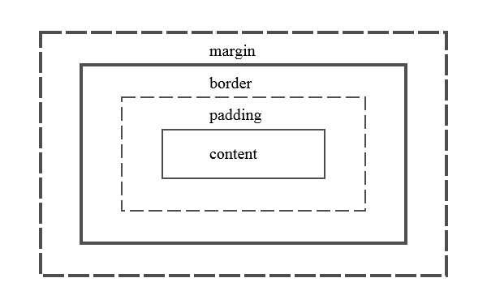
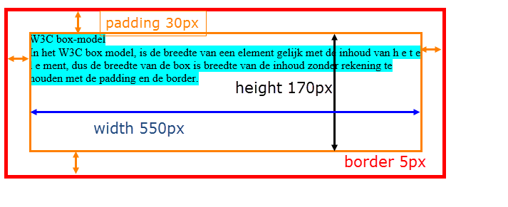
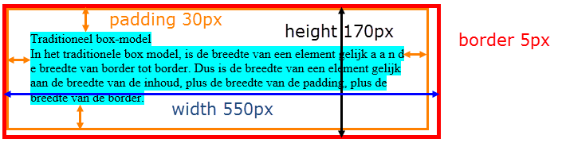

# box model

Elk HTML-element bevind zich in een **denkbeeldige doos**, [het CSS box model](https://developer.mozilla.org/en-US/docs/Learn_web_development/Core/Styling_basics/Box_model). Die rechthoekige doos heeft een marge (**margin**), een rand (**border**) en een opvulling (**padding**). Voor zowel margin, border en padding kunnen telkens de vier zijden bepaald worden. Van binnen naar buiten bestaat de CSS-box uit:

* de inhoud van het element (content)
* [padding](https://developer.mozilla.org/en-US/docs/Web/CSS/Reference/Properties/padding)
* [border](https://developer.mozilla.org/en-US/docs/Web/CSS/Reference/Properties/border)
* [margin](https://developer.mozilla.org/en-US/docs/Web/CSS/Reference/Properties/margin)



## box modellen (box-sizing)

Er zijn verschillende manieren waarop de browser kan omgaan met de CSS-regels afhankelijk van het model dat je specifieert.

### content-box

In het **box model** is de breedte van een element gelijk met de inhoud van het element. De breedte van de box is dus breedte van de inhoud zonder rekening te houden met de padding en border.



```css
/* Bij het berekenen van de grootte van een box moeten padding en border 
erbij opgeteld worden om de hoogte en breedte van het element te berekenen.*/
* {
    box-sizing: content-box
}
```

### border box

In het **traditionele box model** is de breedte van een element gelijk aan de breedte van border tot border. Dus de breedte van een element is gelijk aan de breedte van de inhoud, plus de breedte van de padding en die van de border. Met uitzondering van IE in "Quirks Mode" (IE5.5 Mode) gebruiken alle browsers het traditionele box-model.



```css
/* Met de box-sizing eigenschap kan bepaalt worden hoe boxen gemeten worden.*/

/* Padding en border worden meegerekend in de hoogte en breedte van een element. 
Deze is de meest intuïtieve manier om met boxen te werken.*/
* {
    box-sizing: border-box
}
```


 
Het is een industrie-standaard om altijd met border-box te werken! 

Een goede CSS Reset of Normalize CSS file zet standaard alle boxen op `border-box`. Dit is de aanbevolen instelling voor moderne webontwikkeling.
Voor meer informatie zie hoofdstuk [CSS Resets](reset.md).
 