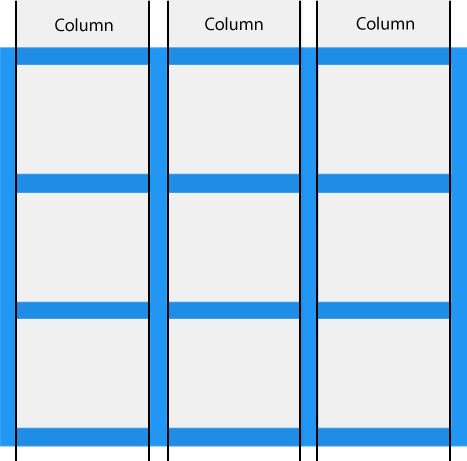
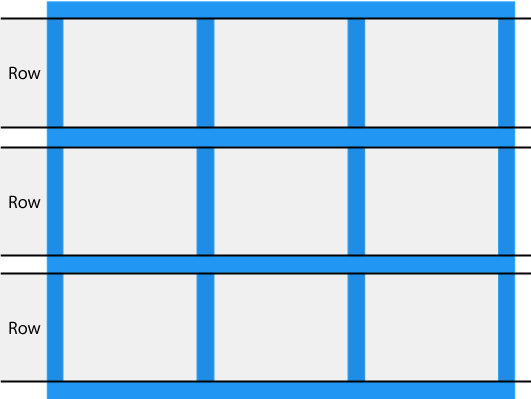
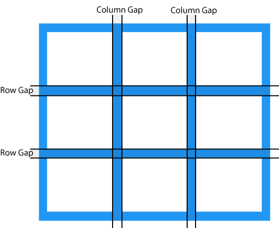
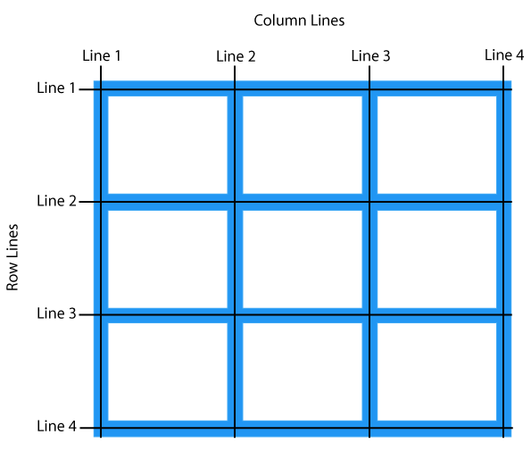

---
metaLinks:
  alternates:
    - >-
      https://app.gitbook.com/s/CyMmymf8tiNQ4Ws9WmHV/css/natuurlijke-volgorde/grid
---

# grid

## grid intro

Lay-outs zijn gemakkelijk te maken met behulp van rasters (grids). Tot nu toe beschikte het web niet over een raster. Er werden daarom allerlei methoden en hacks uitgeprobeerd om een webpagina in een raster weer te geven. Het begon met op tabellen gebaseerde lay-outs, gevolgd door op float gebaseerde lay-outs. Maar dit zijn enkel nepoplossingen omdat **tabellen en float niet bedoeld waren om lay-out**s te maken.

Lay-out met grid biedt een **raster-gebaseerd layout-systeem met rijen en kolommen**, waardoor het gemakkelijker wordt om webpagina's te ontwerpen zonder gebruik te maken van floats en positionering.

{% embed url="https://flems.io/#0=N4IgzgpgNhDGAuEAmIBcIB0sxhAGhADMBLGXVAbVADsBDAWwjUwAt56p8RYB7axfswA8AIx5IAngD4AOtQAEi+UJYRaSCACcpACTUbNQgPSr1W2QqVC6ANykA5WjeO2LS5fVrFqUgLJfqY09vNytaMGINKQBBCI1jcMiIUMUhQh4eRG0AMQys43TM8zljMUkpLkgYBGI+chAANlQAdhAAXzwaBiZ0DAArXAJefghBdHbOkDpGZiwcLmGBeGZ5ACp5YHk5JTEADwBaCIAvbwBzVHkxTQN9vYBuOTa5OTYOPEvxCQ3t+U9NU+8FwADHctpYAA7qJBnYEPahPajPahlL7AH5GdYAchRmPkxDA8ggo3kkM0o3g8hsGU0hOJp00kX2UFoEh4AFcKUhqfJMdCwODmRILvTIrjVkYfnyBSzhQykHDFCKkPtEPRpYh9rQyeFUD9FJjTAZ5IatMb9KaTTTLbiMfIAKzyQiaWg1CAEy3yAC88gAjECgQBSNYSyz6xjUNlKYKh6NRgJKBmnNg29a+p2-UaR70AJkD8gAPooAMzp2Pehp5ws+9OJthe+S5oPisHuTHhyOKQpZR15U1dvu9zSY0G26s09v1xsF+QAFnT-Zp3oAHHnxT8lftTrRwRc-eDdgrLi6ANb09nUZW8KA8TQXADE2Z9AE4Gtki4fIUhodRzr6gfu4QRF5zRpYANy1NQLktO4EVsDZwO1C52xguRYzAuVNUQ34AhQug4ggeCMIg2gLlreBcIXQjGWIi4F1wuQUXkKR5GhGx3ktd5bHeaN3kSDR3kotFLFtWAWFIJAyQUERvGoYkiQUDdFgCU0AHcbw0BRaA5HhPHgfFRPkDdiFVAk10sEQTzPNkL32K8b1I04LIACmzO07XeVz3IbNz3iBDAlwASkPRBdngTUoGIU5qAuWByS0D8oRhBt-12eQQR+dJ+EOYgjggC4ixSwCkQAAUYaFaHkMBYDJYlaAveQnM8A4VMieAWAuCsUoC75zM+HrFFteTDIwwV2QpVQIEICkhtJcl5GocRIozTl8WlL5MSVXEeEIHlvAi2TNzlMUQ0UKVBVlSJDw3VV1QgTC1DAXVQx5D1XpAs0zCtd7rXkW0GnTD0zNbWNFBB7DvDjCHFDI6HIuTX71jHDMI2nEtx3jQts3kGHmz1HlKM7QceyKGlKLJwdhwRtNx0zac7XnImgeGxktx3P8AJ+CzYFPTRz0vHhr1veQH2fV93x+T9v1-PcD0eJFFDkOD0OorDkMlVbzoW2TDwRNpKmgOA9LqZg7SLVAfXaABdNogA" %}

info [box-sizing](https://developer.mozilla.org/en-US/docs/Web/CSS/Reference/Properties/box-sizing)

### grid-elementen

Een grid-lay-out heeft een _parent_ nodig met een **display: grid** of **display: inline-grid**\
Alle directe _children_ binnen een grid-container worden automatisch **grid-elementen.**\\

***

### grid columns

De **verticale lijnen** van de grid-elementen worden **kolommen** (grid columns) genoemd.



### grid-rows

De **horizontale lijnen** van de grid-elementen worden **rijen** (grid rows) genoemd.



### grid-gaps

De **spaties of witruimte** tussen elke kolom of rij worden **gaps** genoemd. Gebruik de CSS-eigenschap "gap" om dit aan te passen.



{% embed url="https://flems.io/#0=N4IgZglgNgpgziAXAbVAOwIYFsZJAOgAsAXLKEAGhAGMB7NYmBvAHgBMIA3AAmqgzhwAvAB0QAcwBOENgFo6DDBDQxJYgHwi03buy69+g0ROlyIjLBoCMLAPQdOm7bocGBwsVJmzzMLNzZaAFcAI1hJWgB3DQAmOwcnHT0ePndjLzMLDQBmeK51HS0k11SjT1MfLJB1ABY8xyKXfVKPE29ff0DQ2A0AVnrEppTDVozKvw0ANgHC52S3MrbMieqAdgHG+Zb0io6NAA4NuZKRnfaq9QBOGe4tAcoQOBhYamIIegREECsABkRJkAAXwo6GwuC++AAVggqApGMwvkCQSBMDg8PhqIIHnCmMQ8AAqbjAW7OEK0AAesjgEAAXspxIhuGTJGxVLIyeSANxaQFaLQkMgUJm0NgATyJjSwGEk4mUjJ+nJJOgADhg2Bw0AzuAqeXy0PgxnClCpJBLnJEZMRCIzfj9OJFuc4pTK5drHSq1RqtTFJH53UyMNQANZSYJoOR0KC0SSMqAQcQkOiSDBQf0cODK-iixkZf1jCyZjCMeS0KBBLBoOA2sCm7I17gxGt5ioF-jFiKRKvcX3KmBFgAUMSFv19-isvVH3FWo4AlM3vOIMMrGT6-bq0FoDbsLGadCFAyGIkFwyWozHuABiMDX-3O2VoeWKxqq9X0x+NdOF7PcMCwLmNFN4zQcYsC7ahcVUf1ISCOA3jAUUSwYXFGXApDJH9MB6GIWRIhgeMSEZMkoDYDCsNkMBsGgb84AwSsqVUCAwFIhgqVpGBGQnNdnEjaNY3w4gngwKQYCYf1mVZc84FLGRL0uDA5Lk7grGVf80F5Dd9S6MIYF3bhDVLcsHyU7hbG4DNaO4bJHXU-AtPCKJdLGDsbRMszVW0GJrIeJ4XjeD48GyS5ECsIEAF1ASAA" %}

### grid-lines

De lijnen tussen kolommen worden **kolomlijnen** (column lines) genoemd.\
De lijnen tussen rijen worden **rijlijnen** (row lines) genoemd.\
Naar deze lijnen wordt verwezen bij het plaatsen van een grid-item binnen een grid-container.



{% embed url="https://flems.io/#0=N4IgzgpgNhDGAuEAmIBcIB0sxhAGhADMBLGXVAbVADsBDAWwjUwAt56p8RYB7axfswA8SYgDcABLCi0cAXgA6IAOYAnYkgC0vfrWLUIqpQD4F1CRJHipM+UuKJ6ARhNOhAelFjT5y15uyYIogDhD0AEwm4R5ePhZWktKBwaH0AMwmaTHixhZm8f5JdiGOACwmpdne+X7WRUH2jgCsJk1VcbWJtg0lYQBsJn3tNQkBxakA7CYTw9TtXJAwCMR85CAAHKh9IAC+eDQMTOgYAFa4BDoC8My7+yB0jMxYOFyXEILoAFQSwBI1AEY8AAemjAxAAXvplKgJIDVEhDJpAUCANxmHZmMxsDh4WE8JAATx+NXotFUyn0MIADCi-r4AA60JCiajQiQ09FmDBqDTaPjwPQGVTE3yiMD0mQEmE8pBo3wyzSOCW0RB8qAAV3o1DAMNo6vgPAkeoNRv1PDlFgVylo9JhTip9NRNUZzKhdodTt8-1osAA1moeOrqFpeFAeKoYVBiMo2LxVLQoHKMdQuQrLoLDBJcv5gACff7VIHg2rwzCAMSESsWiSIIHwTQJ6PUGGwd6IVTVl0stnhD3s6uEfmgiEQGFpD0DocAdwg0bYMMBUFlNUH-E0hAYpClEjAtG1oMMxEIk7XYPBo4kTVUYWrodLEijMfgkFoagg72rcIREZ3PCjSAkMsAE5aBAkCJCcR0k0xagMFSJwRQkdxvgVVIdwFVR4FhYgTgkX0-x4ehr2UaAIIkd5yP0URlCw-4cLwgiiIgEioAkNIJE+dwajTP9NWoUEMPgO1qx4jUtU0d4kDHaCU1g1JSlzXwkJQ9QtDQsBBOw3D1BOYjSPCcjzFnYNo1o+idL01jSg4rj5VUzRCynASySEiRwhE+zHIk4MYVKJMFmgOB4BWbVmDSTYnF2ABdHYgA" %}

{% embed url="https://flems.io/#0=N4IgzgpgNhDGAuEAmIBcIB0sxhAGhADMBLGXVAbVADsBDAWwjUwAt56p8RYB7axfswA8SYgDcABLCi0cAXgA6IAOYAnYkgC0vfrWLUIqpQD4F1CRJHipM+UuKJ6EvhBMBGIQHpRY0+cs+NrJgiiAOEE7wAO48JgBMXj5+FlaS0sGh4ZEsqhCuIMYAzIniyQHW6XZhjhKEPACuRgUALCW+ZimBlSH2NSRi+cYArG1lqUFVWRJgxAAeJgBso2ajXJAwCMR85CAA7KgLIAC+eDQMTOgYAFa4BDoC8MzHpyB0jMxYOFz3EILoAFQSYASDoSABGPFmmhmAC99MpUOCeKokIZNBDZgBuMxHMxmNgcPBIpAATyBoPotFUyn0iIADJiQf4AA60JCiagIiQMnF46ieQF5cxqDSaGQkhrwCQsPKEKVCiSs3L8CTUHiiZQSRhS0RgZniiQAchFSENzkIRv0UH0EE0JrN-08ZgwJu0fHgegMqnJ-l1+toJMRJux-kp1Np3JDFlZ7PhiLiuXoUfBtFgAGs1A1qFpeFBkYjrco2LxVLQoMnXY5-Yg3VB6vRqGBEblmRBaPAABSFIluQiqACUFfUWmUtGZiLcdOZWNBrto9XgPE0qh4USbWv0lNmHcnU9mRPni8HvP5gNgLFISGV4P0BnMCtd909hgkMRRvwkh54lPgxDA54kV0sjACRHWdKZgFBMFUwzFd6mzWt8wkABiQg0OTOp+E0KIIGIIt4ERCEoCQDD3U0QgGFIQNploRtoUMYhCFIrDYQgREhkTZNcyQws2EgWg1CFZMIXfVRETAHhrSQFCAE5aDkuSJCGadkxPDAXB9CxH0k+tqAnCRPAkQoh1FFcognENcWoDBoh4IEmS04da10+MDIkZoTK0Mz9MM4y1PgHI8k0wCnNzFyJDcTzl1XVzDKGSznTqRpgu0usG0RPz-FdbyjIS6z+ggFLQp09KJDiKKco8tSZlmIrRTC0rMsc0yYvcyy1mgOBf22ZghjiVA3GOABdI4gA" %}

Het bovenstaande voorbeeld geeft een raster met 3 kolommen waarbij de rijen minimaal 100px zijn.\\

## grid container

Om ervoor te zorgen dat een HTML-element zich gedraagt als een grid-container moet de display-eigenschap ingesteld worden op **grid** of **inline-grid**. Grid-containers bestaan uit grid-items die in kolommen en rijen worden geplaatst.

\\\\

### grid-template-columns

De **grid-template-columns** bepaalt het aantal kolommen in een grid en de **breedte van elke kolom**. Bij een door spaties gescheiden lijst, definieert elke waarde de breedte van de respectieve kolom. Als het grid 4 kolommen bevat, moet telkens de breedte van de 4 kolommen gedefinieerd worden. Indien alle kolommen dezelfde breedte moeten hebben, wordt er gebruik gemaakt van `auto`.

{% embed url="https://flems.io/#0=N4IgzgpgNhDGAuEAmIBcIB0sxhAGhADMBLGXVAbVADsBDAWwjUwAt56p8RYB7axfswA8SYgDcABLCi0cAXgA6IAOYAnYkgC0vfrWLUIqpQD4F1CRJHjjARiEB6UWNPnLT4wCYH7sxavOAZm9rC183awAWYOcw-2MAVmiXP3cANiTQ1ziAdiTY9wAOPOokrkgYBGI+chAATlRUkABfPBoGJnQMACtcAh0BeGZm1pA6RmYsHC5+iEF0ACoJYAkwgCMeAA9NMGIAL31lVAl11SRDTXWNgG4zJrMzNg48Y54kAE8lsPpaVWV9I4ADFcVq4AA60JCiaiHCRA273agYNQabR8eB6AyqT6uURgUEyN5HZFIG6uYmaRD0fG0RCoqAAV3o1DAR3iANBGwkHgB7M5tHp8B4ElqvNJFnJylooKONlFYXBkIOMrlrlWtFgAGs1Dx6dQtLwoDxVEcoMRlGxeKpaFBSXdqGYkep9WiMYYJMYJE5sRY1ZrtbrnYbjRIAMSEcNiiSIDbwTTWs3UI6wWaIVSRhVQmHcjmwyOENHbPYQI7Z65hfP8TQAdwgZrYR3WUBJ5YLhAYpEJEjAtGZ20MxEIeYLO12xYk8VUEHokYNRpNdfgkFoaggs0jJzOwbAPFNSFDtVoB4PEhsHNtZWgcHgVWZzA82VQNmaAF0mkA" %}

\\\\

### grid-template-rows

De **grid-template-rows** definieert de **hoogte van elke rij**. Bij een door spaties gescheiden lijst, definieert elke waarde de breedte van de respectieve rij.

{% embed url="https://flems.io/#0=N4IgzgpgNhDGAuEAmIBcIB0sxhAGhADMBLGXVAbVADsBDAWwjUwAt56p8RYB7axfswA8SYgDcABLCi0cAXgA6IAOYAnYkgC0vfrWLUIqpQD4F1CRJHjjARiEB6UWNPnLT4wCYH7sxavOAZm9rC183awAWYOcw-2MAVmiXP3cANiTQ6iSuSBgEYj5yEAB2VFSQAF88GgYmdAwAK1wCHQF4ZkrqkDpGZiwcLlaIQXQAKglgCTCAIx4AD00wYgAvfWVUCVnVJENNWbmAbjMKszM2DjxNniQATwmw+lpVZX0NgAYDqdcAB1okUWo6wkH2Op2oGDUGm0fHgegMqnurlEYG+MhuG0hSCOrkxmkQ9FRtEQ0KgAFd6NQwBtaKT4DwJDS6QzaTxsRZcfjCcTVDwAO5UiQ2N5vb5zCQeYWitkSXHKWjfDZCqVhX7-NaKkWHGa0WAAazUPFJ1C0vCgPFUGygxGUbF4qloUGxJ2oZgh6hNMLhhgkxgkTkRFmmOv1PKNHrNFokAGJCLHpYg5vBNA7rdQNrBhohVNLVQCgRLRcDpYQYYsVhANgWta4S-xNLyINa2BtZlAsWFa0nCAxSOiJGBaJTFoZiIRi6WlssKxJ4qoIPRpabzZam-BILQ1BBhtKtjtI2AeFakNGAJy0M9nwXK6gVHLQODwAqU5geAAcqBslQAuhUgA" %}

\\\\

### justify-content

De **justify-content** wordt gebruikt om het hele grid binnen de container uit te lijnen, waarbij justify-content de volgende waarden kan aannemen:

justify-content: **space-evenly | space-around | space-between | center | start | end**

```css
.grid-container {
  display: grid;
  justify-content: space-evenly;
}
```

\\\\

### align-content

De **align-content** wordt gebruikt om het hele grid binnen de container **verticaal** uit te lijnen, waarbij align-content de volgende waarden kan aannemen:

align-content: **space-evenly | space-around | space-between | center | start | end**

```css
.grid-container {
  display: grid;
  height: 400px;
  align-content: center;
}
```

## grid item

### child elements (items)

Een grid-container bevat grid-items. Standaard heeft een container één grid-item voor elke kolom, in elke rij, maar grid-items kunnen zo opgemaakt worden dat ze meerdere kolommen en/of rijen beslaan.

### grid-column

De **grid-column** definieert op welke kolom(men) een item moet worden geplaatst. Er kan bepaald worden waar het item begint en waar het eindigt. Enkele voorbeelden:

* .item1 { grid-column: 1 / 5; } item 1 start in kolom 1 en eindigt voor kolom 5
* .item1 { grid-column: 1 / span 3; } item 1 start in kolom 1 en voegt 3 kolommen samen
* .item2 { grid-column: 2 / span 3; } item 1 start in kolom 2 en voegt 3 kolommen samen

\\\\

### grid-row

De **grid-row** definieert op welke rij(en) een item moet worden geplaatst. Er kan bepaald worden waar het item begint en waar het eindigt. Enkele voorbeelden:

* .item1 { grid-row: 1 /4; }\
  \=> item 1 start in rij 1 en eindigt voor rij 4
* .item1 { grid-column: 1 / span 2; }\
  \=> item 1 start in rij 1 en voegt 2 rijen samen

\\\\

### grid-area

De **grid-area** kan worden gebruikt als een verkorte eigenschap voor de volgende 4 eigenschappen **grid-row-start, grid-column-start, grid-row-end** en **grid-column-end**. Enkele voorbeelden:

* .item1 { grid-area: 1 / 2 / 5 / 6; }\
  \=> item 1 start op rijlijn 1 en kolomlijn 2, en eindigt op rijlijn 5 en kolomlijn 6
* .item1 { grid-area: 2 / 1 / span 2 / span 3; }\
  \=> item 1 start op rijlijn 2 en kolomlijn 1, en omvat 2 rijen en 3 kolommen

\\\\\\

### grid-template-areas

De eigenschap **grid-area** kan ook worden gebruikt om **namen toe te wijzen aan grid-items**. Door alle items correct te benoemen en toe te wijzen aan een grid-area kan een kant-en-klare grid-template gemaakt worden voor een webpagina.

```css
header {grid-area: header;}
nav {grid-area: menu;}
main {grid-area: main;}
aside {grid-area: right;}
footer {grid-area: footer;}

body {
  display: grid;
  grid-template-areas:
    'header header header header header header' /* 6fr header */
    'menu   main   main   main   right  right' /* 1fr menu | 3fr main | 2 right */ 
    'menu   footer footer footer footer footer'; /* 1fr menu | 5fr footer */
    }
```

{% embed url="https://flems.io/#0=N4IgzgpgNhDGAuEAmIBcIB0sxhAGhADMBLGXVAbVADsBDAWwjUwAt56p8RYB7axfswA8AIx5IAngD4AOtQAEi+UJYRaSCACcpACTUbNQgPSr1W2QqVC6ANykA5WjeO2LS5fVrFqUgLJfqY09vNytaMGINKQBBCI1jcMiIUMUhQh4eRG0AMQys43TM8zljMUkpLkgYBGI+chAANlQAdhAAXzwaBiZ0DAArXAJefghBdHbOkDpGZiwcLmGBeGZ5ACp5YHk5JTEADwBaCIAvbwBzVHkxTQN9vYBuOTa5OTYOPEvxCQ3t+U9NU+8FwADHctpYAA7qJBnYEPahPajPahlL7AH5GdYAchRmPkxDA8ggo3kkM0o3g8hsGU0hOJp00kX2UFoEh4AFcKUhqfJMdCwODmRILvTIrjVkYfnyBSzhQykHDFCKkPtEPRpYh9rQyeFUD9FJjTAZ5IatMb9KaTTTLbiMfIAKzyQiaWg1CAEy3yAC88gAjECgQBSNYSyz6xjUNlKYKh6NRgJKBmnNg29a+p2-UaR70AJkD8gAPooAMzp2Pehp5ws+9OJthe+S5oPisHuTHhyOKQpZR15U1dvu9zSY0G26s09v1xsF+QAFnT-Zp3oAHHnxT8lftTrRwRc-eDdgrLi6ANb09nUZW8KA8TQXADE2Z9AE4Gtki4fIUhodRzr6gfu4QRF5zRpYANy1NQLktO4EVsDZwO1C52xguRYzAuVNUQ34AhQug4ggeCMIg2gLlreBcIXQjGWIi4F1wuQUXkKR5GhGx3ktd5bHeaN3kSDR3kotFLFtWAWFIJAyQUERvGoYkiQUDdFgCU0AHcbw0BRaA5HhPHgfFRPkDdiFVAk10sEQTzPNkL32K8b1I04LIACmzO07XeVz3IbNz3iBDAlwASkPRBdngTUoGIU5qAuWByS0D8oRhBt-12eQQR+dJ+EOYgjggC4ixSwCkQAAUYaFaHkMBYDJYlaAveQnM8A4VMieAWAuCsUoC75zM+HrFFteTDIwwV2QpVQIEICkhtJcl5GocRIozTl8WlL5MSVXEeEIHlvAi2TNzlMUQ0UKVBVlSJDw3VV1QgTC1DAXVQx5D1XpAs0zCtd7rXkW0GnTD0zNbWNFBB7DvDjCHFDI6HIuTX71jHDMI2nEtx3jQts3kGHmz1HlKM7QceyKGlKLJwdhwRtNx0zac7XnImgeGxktx3P8AJ+CzYFPTRz0vHhr1veQH2fV93x+T9v1-PcD0eJFFDkOD0OorDkMlVbzoW2TDwRNpKmgOA9LqZg7SLVAfXaABdNogA" %}

### ordenen

Door te werken met grid kunnen de grid-items overal geplaatst worden waar je maar wil. Het eerste item in de HTML-code hoeft dus niet als eerste item in het raster te verschijnen.

```css
.item1 { grid-area: 1 / 3 / 2 / 4; }
.item2 { grid-area: 2 / 3 / 3 / 4; }
.item3 { grid-area: 1 / 1 / 2 / 2; }
.item4 { grid-area: 1 / 2 / 2 / 3; }
.item5 { grid-area: 2 / 1 / 3 / 2; }
.item6 { grid-area: 2 / 2 / 3 / 3; }
```

```css
@media only screen and (max-width: 500px) {
  .item1 { grid-area: 1 / span 3 / 2 / 4; }
  .item2 { grid-area: 3 / 3 / 4 / 4; }
  .item3 { grid-area: 2 / 1 / 3 / 2; }
  .item4 { grid-area: 2 / 2 / span 2 / 3; }
  .item5 { grid-area: 3 / 1 / 4 / 2; }
  .item6 { grid-area: 2 / 3 / 3 / 4; }
}
```

\\\\

## video: single-line CSS layouts voor o.a. flex en grid


10 modern layouts in 1 line of CSS



Je kan oefenen op CSS Grid met:

* [Grid Garden](https://cssgridgarden.com)
* [An Interactive Guide to CSS Grid](https://www.joshwcomeau.com/css/interactive-guide-to-grid/)

