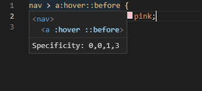

# voorrangsregels

CSS-specificiteit is een cruciaal concept bij het begrijpen van de voorrangsregels die bepalen welke stijlen op een bepaald element van toepassing zijn als er meerdere regels zijn gedefinieerd. De tool [Specificity Calculator](https://specificity.keegan.st) biedt een waardevol inzicht in de specificiteit van CSS-selectors.

## specificiteit berekenen

Specificiteit wordt vaak uitgedrukt in vier cijferreeksen (bijv. `0,0,1,0`). Elke reeks vertegenwoordigt het gewicht van een bepaald onderdeel van de selector:

1. **duizendtallen:** Aantal ID-selectors.
2. **honderdtallen:** Aantal class-, attribute- en pseudo-class-selectors.
3. **tientallen:** Aantal elementselectors en pseudo-elementselectors.
4. **eenheidsgetallen:** Aantal inline-stijlen.

Bijvoorbeeld:

* `div p` heeft een specificiteit van `0,0,2,0` omdat het twee elementselectors heeft.
* `#main .intro` heeft een specificiteit van `1,1,0,0` vanwege één class-selector en één elementselector.

## voorbeelden

Laten we enkele voorbeelden bekijken:

```css
/* Voorbeeld 1 */
#main p {
  color: red; /* Specificiteit: 0,1,0,0 */
}

/* Voorbeeld 2 */
.article p {
  color: blue; /* Specificiteit: 0,0,1,0 */
}

/* Voorbeeld 3 */
#main p.article {
  color: green; /* Specificiteit: 0,1,1,0 */
}
```

In dit geval zal de derde regel (`#main p.article`) de voorkeur hebben boven de eerste twee vanwege de hogere specificiteit.

## visualisatie in VS Code

Een handige functie van Visual Studio Code is dat het de specificiteit van CSS-selectors kan weergeven wanneer je met de muis over de selector zweeft. Dit is vooral nuttig bij het snel begrijpen van de specificiteit van een bepaalde regel tijdens het schrijven van code.



## tips voor praktisch gebruik

1. **Wees specifiek indien Nodig:** Gebruik specifieke selectors wanneer je ervoor wilt zorgen dat een bepaalde stijl wordt toegepast, maar vermijd overmatige specificiteit als het niet nodig is.
2. **vermijd !important:** Het gebruik van `!important` maakt stijlen moeilijk te overschrijven en kan leiden tot problemen met onderhoud.
3. **erfenis en onderhoud:** Begrijp de erfenis van specificiteit en houd hier rekening mee bij het onderhouden van een codebase.
