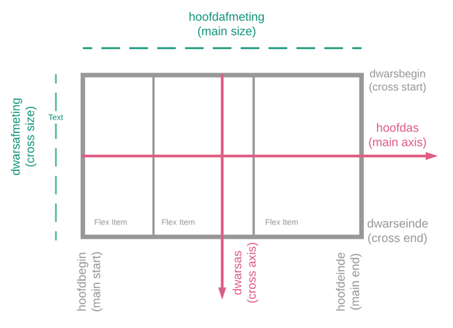
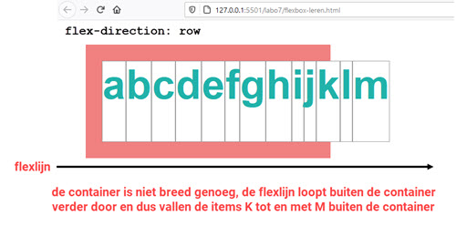
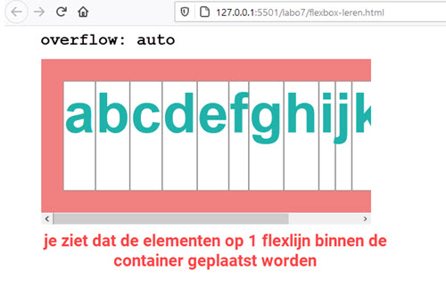
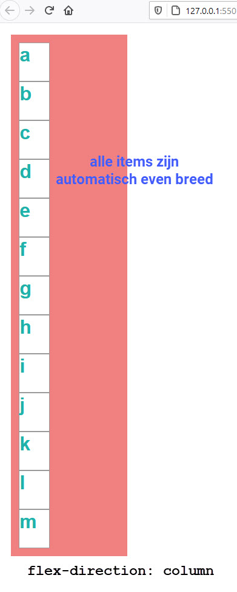
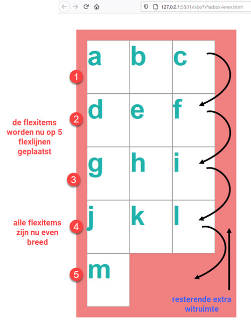
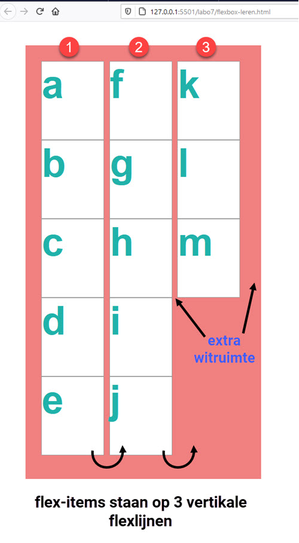
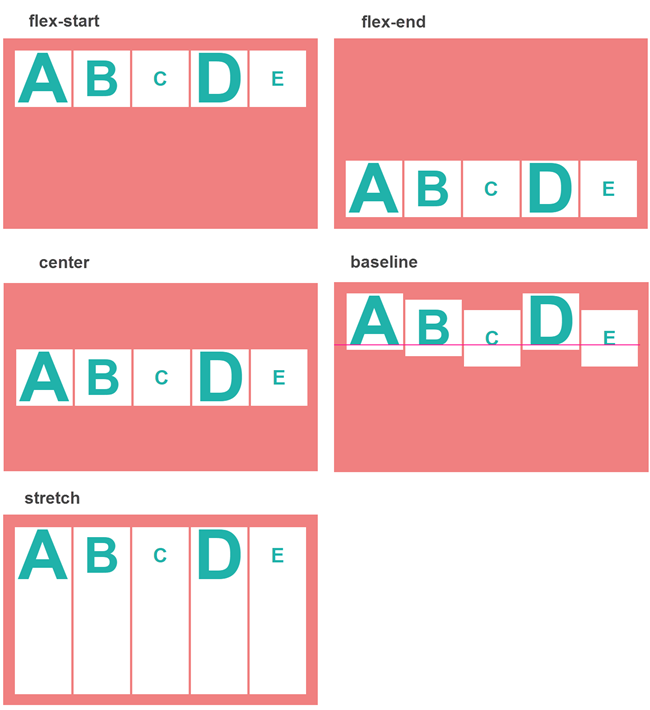
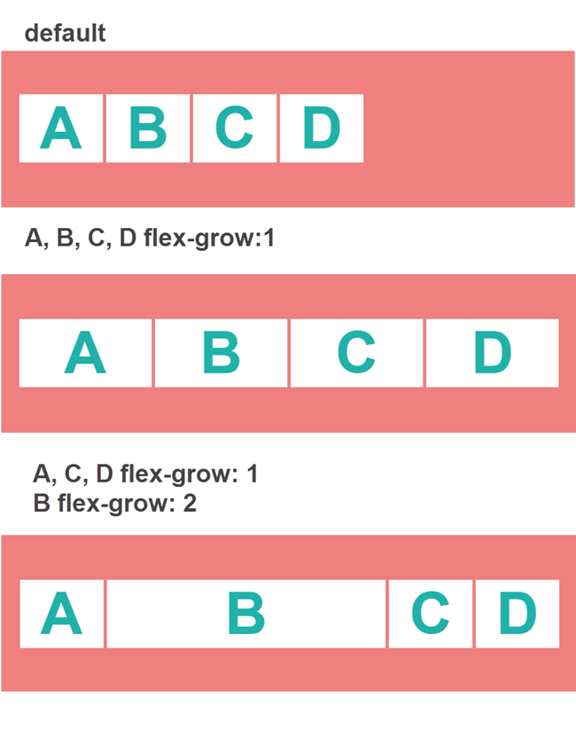
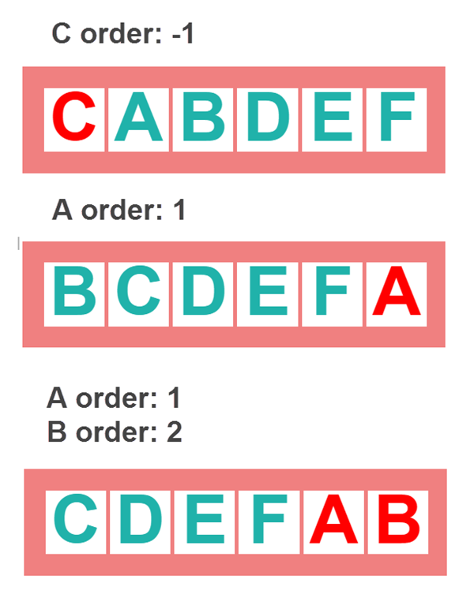

# flex

## definitie

Flexbox of de flexibele kaders lay-out, is een nieuwe manier om een lay-out met CSS3 te maken en is bedoeld voor het opmaken van complexe applicaties en webpagina's.

## doel

Met flexbox kan je elementen lay-outen in een container. Je kan ze

* op een bepaalde plaats zetten;
* in een bepaalde volgorde;
* uitlijnen;
* de ruimte er tussen (en/of rond) verdelen, ongeacht hun grootte.

M.a.w. je kan die elementen in de container letterlijk flexibel maken, ze kunnen:

* gerekt en gekrompen worden tot ze passen in de hen toegekende ruimte;
* worden gerangschikt in verhouding tot elkaar;
* alle beschikbare ruimte tussen of rond hen kan worden verdeeld op basis van een opgegeven verhouding;

Je kan de elementen in een container lay-outen in twee richtingen, de zogenaamde **flex richtingen: horizontaal en verticaal**.

Je bent niet gebonden aan één richting als in andere lay-out technieken. Dit maakt meer adaptieve en **responsieve lay-outs** mogelijk die zich aanpassen aan de **lay-out veranderingen op verschillende schermformaten en oriëntaties**.

Tenslotte kan je de visuele volgorde van elementen binnen de container veranderen zonder dat hun werkelijke volgorde in de markup gewijzigd moet worden.

```markup
<!DOCTYPE html>
<html lang="nl-BE">
<head>
    <meta charset="UTF-8">
    <meta name="viewport" content="width=device-width, initial-scale=1.0">
    <style>
        * {
            box-sizing: border-box;
        }

        .item-container {
            width: 30rem;
            margin: 3rem;
            padding: 2rem;
            background-color: lightcoral;
        }

        .item {
            background-color: #fff;
            margin: 0;
            padding: 0;
            width: 8rem;
            height: 10rem;
            font-weight: bold;
            font-family: sans-serif;
            font-size: 5rem;
            color: lightseagreen;
            border: solid #9a9a9a 1px;
        }
    </style>
    <title>Flexbox leren</title>
</head>
<body>
    <section class="item-container" id="item-container">
        <article class="item">a</article>
        <article class="item">b</article>
        <article class="item">c</article>
        <article class="item">d</article>
        <article class="item">e</article>
        <article class="item">f</article>
        <article class="item">g</article>
        <article class="item">h</article>
        <article class="item">i</article>
        <article class="item">j</article>
        <article class="item">k</article>
        <article class="item">l</article>
        <article class="item">m</article>
    </section>
</body>
</html>
```

Hierboven staat de code met interne CSS als start voor verdere oefeningen en voorbeelden doorheen dit hoofdstuk.

## concepten en terminologie

Alvorens de flexbox eigenschappen, waarmee je de flexbox lay-out kan bepalen en aanpassen, te overlopen moeten we eerst twee concepten en termen uitleggen, namelijk _flex assen_ en _flex lijnen_.

#### flex assen

In tegenstelling tot blok en inline opmaak, waarvan de lay-out is gebaseerd op blok en inline flow richtingen, is flex lay-out gebaseerd op _flex richtingen_ (flex directions).

Het begrip flex richtingen is gebaseerd op het concept van assen die de richting waarlangs flex items worden gelay-out. De volgende afbeelding toont de assen die gedefinieerd kunnen worden op een flex container:



Afhankelijk van de ingestelde waarden van de Flexbox eigenschappen worden de flex items in een flex container gelay-out volgens de hoofdas of de dwarsas. De items worden gelay-out afhankelijk van de gekozen as:

* De _hoofdas_ van een flex container is de primaire as waarlangs flex items worden gelay-out. Die strekt zich over de de _hoofdafmeting_.
* De flex items worden geplaatst binnen de container en beginnen aan de _hoofd-begin_ kant en gaan in de richting van het _hoofd-einde_ kant.
* De breedte of hoogte van een flex item, afhankelijk van welke van de twee in de hoofdrichting ligt, is de _hoofdafmeting_ van het item. De hoofdafmeting van een flex item is ofwel de breedte- of de hoogte-eigenschap, afhankelijk van wat de hoofdrichting is.
* De as loodrecht op de hoofdas is de _dwarsas_. Die strekt zich iot over de _dwarsafmeting_.
* De breedte of hoogte van een flex item, afhankelijk van welke van de twee in de dwarsafmeting ligt, is de _dwarsafmeting_ van het item. Het dwarsafmeting eigenschap is ofwel de breedte of hoogte, afhankelijk van welke in de dwarsafmeting ligt.
* Flex lijnen (flex lines) (zie volgende paragraaf hieronder) worden gevuld met items en in de container geplaatst en beginnen aan het dwars-begin kant van de flex container en gaan in de richting van het dwars-einde kant.

Het is noodzakelijk dat je vertrouwd geraakt met deze begrippen vooraleer de Flexbox lay-out te gebruiken. Alles in de Flexbox lay-out heeft te maken met deze twee assen.

#### flex lijnen

Flex items in een flex container worden gelay-out en en uitgelijnd op flex lijnen. Een flex lijn is een imaginaire lijn waarop flex items in hun container gegroepeerd en uitgelijnd worden. Flex lijnen volgen de hoofdas. Een flex container bestaat uit ofwel één enkelvoudige lijn of meerdere lijnen, afhankelijk van hoe de `flex-wrap` eigenschap is ingesteld:

In een één-lijn flex container worden alle kinderen gelay-out op één enkele lijn. Als er meer items zijn dan dat erop de lijn passen vallen die buiten de container.

Een multi-lijn flex container breekt haar flex items over meerdere lijnen, vergelijkbaar met hoe de tekst wordt afgebroken op een nieuwe regel wanneer die te groot wordt om op één lijn te passen. Als er extra lijnen worden gemaakt, worden ze gestapeld in de flex container langs de dwarsas in overeenstemming met de waarde van de `flex-wrap` eigenschap. Elke lijn bevat ten minste één flex item, tenzij de flexibele container zelf geheel leeg is.

## schrijfwijzen

Bovenstaande illustratie gaat ervan uit dat de schrijfwijze van links naar rechts (LTR) is. De flex lijn volgt de richting van de tekst die in een links-naar-rechts modus, van links naar rechts en van boven naar beneden gaat.

Als je de richting van de tekst met de eigenschap `writing-mode` wijzigt, zal de richting van de flex lijn ook veranderen.

Bij het wijzigen van `writing-mode` zullen de richtingen van zowel de hoofdas en dwarsas ook veranderen. Bijvoorbeeld, in een Japanse taalindeling, loopt de hoofdas verticaal en de dwarsas horizontaal. In de de `flex-flow` sectie vind je een voorbeeld.

## flex container

### display: flex

Om met flexbox aan de slag te gaan, begin je met het maken van een **flex container.**

```css
.item-container {
    width: 30rem;
    margin: 3rem;
    padding: 2rem;
    /* door display eigenschap in te stellen op flex 
    wordt html-element een flex-container*/
    display: flex;
    background-color: lightcoral;
}
```

\
Kinderen van een flex container zijn de zogenaamde **flex items**. Ze worden gelay-out in de flex container met behulp van de flexbox-eigenschappen.

```css
.item {
    background-color: #fff;
    margin: 0;
    padding: 0;
    width: 8rem;
    height: 10rem;
    font-weight: bold;
    font-family: sans-serif;
    font-size: 5rem;
    color: lightseagreen;
    border: solid #9a9a9a 1px;
}
```

### flex-direction

Elementen in een container kunnen in twee richtingen gelay-out worden, de zogenaamde flex richtingen.

#### flex-direction: row (= horizontaal)

Standaard wordt de `flex-direction` eigenschap ingesteld op `row`. De flex-items worden horizontaal van links naar rechts op 1 **flex-rij** geplaatst.



Als de overflow-eigenschap wordt ingesteld op auto, worden flex-items op één flexlijn getoond. De flex-items buiten de container worden zichtbaar gemaakt door horizontaal te scrollen.

```css
.item-container {
    width: 30rem;
    margin: 3rem;
    padding: 2rem;
    display: flex;
    background-color: lightcoral;
    overflow: auto;
}
```



#### flex-direction: column (= verticaal)

Als de `flex-direction` eigenschap wordt ingesteld op column, worden alle flex-items worden verticaal van boven naar onder in 1 **flex-kolom** geplaatst.

```css
.item-container {
    width: 30rem;
    margin: 3rem;
    padding: 2rem;
    display: flex;
    flex-direction: column;
    background-color: lightcoral;
    overflow: auto;
}
```



### flex-wrap

#### flex-direction: row | flex-wrap: wrap

Als de **flex-items niet mogen doorlopen op 1 flexlijn buiten de container**, moet de `flex-wrap` op `wrap` ingesteld worden. Standaard staat die op `nowrap`. De `flex-direction` eigenschap wordt hieronder ingesteld op `row` en de `flex-wrap` op `wrap.`

```css
.item-container {
    width: 30rem;
    margin: 3rem;
    padding: 2rem;
    display: flex;
    flex-direction: row;
    flex-wrap: wrap;
    background-color: lightcoral;
    overflow: auto;
}
```



#### flex-direction: column | flex-wrap: wrap

```css
.item-container {
    width: 30rem;
    margin: 3rem;
    padding: 2rem;
    display: flex;
    flex-direction: column;
    flex-wrap: wrap;
    background-color: lightcoral;
    overflow: auto;
}
```

#### flex-direction: column | flex-wrap: wrap | height

Aan de flex-container hierboven werd geen hoogte toegekend. Indien de **height** eigenschappen worden ingesteld, zullen de f**lex-items op meer dan één verticale flexlijn** geplaatst worden.

```css
.item-container {
    width: 30rem;
    /* hoogte wordt ingesteld */
    height: 55rem;
    margin: 3rem;
    padding: 2rem;
    display: flex;
    flex-direction: column;
    flex-wrap: wrap;
    background-color: lightcoral;
    overflow: auto;
}
```



### flex-flow

Bij flex-flow wordt flex-direction en flex-wrap gecombineerd in één eigenschap.

```css
.item-container {
    width: 30rem;
    height: 55rem;
    margin: 3rem;
    padding: 2rem;
    display: flex;
    /* combineren van flex-direction & flex-wrap */
    flex-flow: row wrap;
    background-color: lightcoral;
    overflow: auto;
}
```

try it yourself: [https://developer.mozilla.org/en-US/docs/Web/CSS/flex-flow](https://developer.mozilla.org/en-US/docs/Web/CSS/flex-flow)

### witruimte

De flex-items worden over de flexlijnen verdeeld, als een flex-item niet meer op de flexlijn past, wordt die naar een volgende flexlijn verplaatst. De overgebleven ruimte op de flexlijn wordt gevuld met witruimte. Het einde van de flexlijn is onderaan, wanneer `flex-direction` ingesteld staat op `column`, staat rechts als `flex-direction` ingesteld staat op `row`.

De `height` van de container werd ingesteld op `55rem`. Hoogte en breedte zijn ingesteld. Wat gebeurt er met de witruimte?

#### witruimte > justify-content

De **`justify-content`** eigenschap lijnt flex-items uit \*\*langs de hoofdas \*\*van de huidige flexlijn van de flex container, dus in dezelfde richting als `flex`. Dit gebeurt pas nadat alle flexibele lengtes en alle auto marges zijn ingesteld.

```css
justify-content: flex-start | flex-end | center | space-between | space-around
```


#### witruimte > align-content

De `align-content` eigenschap lijnt de flexlijnen uit binnen de flex-container als er extra ruimte beschikbaar is **in de dwarsas**, vergelijkbaar met hoe `justify-content` afzonderlijke items uitlijnt over hoofdas. Deze eigenschap heeft geen effect als de flex-container slechts één enkele lijn heeft. Als `flex-direction` op `column` is ingesteld wisselen hoofdas en dwarsas van rol.

```css
align-content: flex-start | flex-end | center | space-between | space-around | stretch
```


#### witruimte > align-items

De eigenschap `align-items` specificeert de standaarduitlijning voor items in de flexibele container.

```css
align-items: flex-start | flex-end | center | baseline | stretch
```



## flex-items

### flex-grow

Met de `flex-grow` eigenschap wordt de \_flex-groei-factor \_van een flex-item ingesteld. Een flex-groei-factor is een \<getal> dat bepaalt hoeveel het flex-item groter wordt ten opzichte van de rest van de flex-items in de flex-container wanneer **positieve vrije ruimte** wordt verdeeld.





### flex-shrink

De `flex-shrink` eigenschap stelt de \*\*flex-krimpfactor \*\*van een flex-item in. De flex-krimpfactor is een \<getal> dat aangeeft hoeveel een flex-item ten opzichte van de andere flex-items in de flexibele container krimpt, wanneer **negatieve vrije ruimte** wordt verdeeld. De flex-krimpfactor wordt vermenigvuldigd met de `flex basis` (zie flex-basis) bij de verdeling van negatieve ruimte. De initiële waarde is nul (0), wat betekent dat standaard de items niet krimpen en negatieve getallen zijn ongeldig.



### flex-basis

De `flex-basis` eigenschap neemt de waarde van de width eigenschap over en stelt de flex basis in: de initiële hoofdafmeting (zie [concepten en terminologie](https://apwt.gitbook.io/g_webtechnologie/ui-ux/ui-ux-flex#concepten-en-terminologie)) van het flex-item, voordat de vrije ruimte wordt verdeeld op basis van de flex factoren (zie [de flex-grow eigenschap](https://apwt.gitbook.io/g_webtechnologie/ui-ux/ui-ux-flex#flex-grow) en [de flex-shrink eigenschap](https://apwt.gitbook.io/g_webtechnologie/ui-ux/ui-ux-flex#flex-shrink)).



### align-items

De `align-items` eigenschap stelt de standaard uitlijning in voor alle items van de flex container. De `align-self` eigenschap maakt het mogelijk deze standaard uitlijning te overschrijven voor de afzonderlijke flex-items.

```css
align-self: auto | flex-start | flex-end | center | baseline | stretch
```



### order

Flex-items worden standaard weergegeven in hun natuurlijke volgorde, namelijk in dezelfde volgorde als in het brondocument. Met de `order` eigenschap kan de natuurlijke volgorde veranderd worden.

```css
order: <integer>
```



## extra info



meer info: [https://www.w3schools.com/css/css3\_flexbox.asp](https://www.w3schools.com/css/css3_flexbox.asp)\
meer info: [https://css-tricks.com/snippets/css/a-guide-to-flexbox/](https://css-tricks.com/snippets/css/a-guide-to-flexbox/)\
meer info: [https://freshman.tech/flexbox-navbar/](https://freshman.tech/flexbox-navbar/)


Je kan oefenen op CSS Flex met:

* [Flex Froggy](https://flexboxfroggy.com)
* [Flex Defense](https://www.flexboxdefense.com)
* [Interactive guide to flexbox](https://www.joshwcomeau.com/css/interactive-guide-to-flexbox/)

