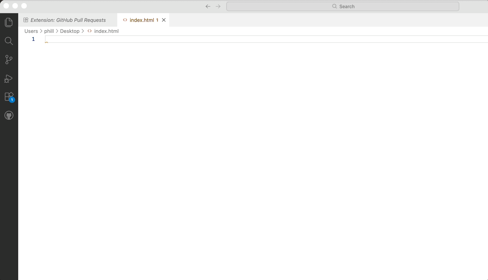

---
metaLinks:
  alternates:
    - https://app.gitbook.com/s/CyMmymf8tiNQ4Ws9WmHV/html/intro
---

# Structuur

Webpagina's bestaan uit terugkerende onderdelen: titels, tussenkopjes, paragrafen, afbeeldingen en formulieren. Een duidelijke structuur helpt zowel mensen als machines (zoals zoekmachines en schermlezers) om de inhoud te begrijpen en correct weer te geven. HTML (HyperText Markup Language) gebruik je om die structuur vast te leggen met elementen (tags). Voor verschillende soorten inhoud bestaan er specifieke HTML-elementen — bijvoorbeeld koppen voor titels, paragrafen voor tekst, lijsten voor opsommingen en formulieren voor invoer.

In deze pagina behandelen we de belangrijkste bouwstenen van een HTML-document en laten we zien hoe je een basisstructuur op een correcte manier opzet.

## Doctype declaratie

De doctype (document type declaration) vertelt de browser welk type HTML-document volgt en zorgt dat de browser in de juiste renderingmodus (standaardenmodus) werkt. Voor moderne webpagina's gebruik je de korte en aanbevolen HTML5-doctype:

```html
<!doctype html>
```

Plaats deze regel helemaal bovenaan het HTML-bestand, vóór het `<html>`-element — zonder lege regels of andere tekens ervoor. De doctype is niet hoofdlettergevoelig.


Kort historisch: oudere HTML4- en XHTML-doctypes waren veel langer en konden invloed hebben op of een browser in [quirks- of in standaardenmodus](https://developer.mozilla.org/en-US/docs/Web/HTML/Guides/Quirks_mode_and_standards_mode) rendert. Voor nieuwe pagina's gebruiken we altijd de eenvoudige HTML5-doctype.


## `<html>`

Het `<html>`-element markeert het begin en einde van een HTML-document en geeft aan dat het document HTML-code bevat. Dit element wordt ook wel het root-element genoemd.

Een HTML-document bestaat uit twee delen: de `<head>` en de `<body>`.

```html
<html lang="nl-BE">
   <head>
   </head>
   <body>
   </body>
</html>
```

In het voorbeeld zie je het juiste gebruik van een [lang-attribuut](https://developer.mozilla.org/en-US/docs/Web/HTML/Reference/Global_attributes/lang). Dit attribuut wordt voornamelijk gebruikt door zoekmachines die webpagina's indexeren en door voorleessoftware om te kunnen achterhalen hoe ze de tekst moeten uitspreken. Ook jouw browser gebruikt dit om vertaalsuggesties te doen. Zorg dat je steeds de juiste taalcode gebruikt.

## `<head>`

Het `<head>`-element bevat metadata (gegevens over gegevens) over het HTML-document. Metadata zijn niet zichtbaar op de webpagina zelf, maar ze zijn belangrijk voor zoekmachines, browsers en andere webservices.

Binnen het `<head>`-element kun je verschillende elementen opnemen, zoals:

* `<title>`: Bepaalt de titel van de webpagina die in de browserbalk wordt weergegeven.
* `<meta>`: Bevat metadata zoals de tekenset, beschrijving van de pagina, trefwoorden, auteur, en viewport-instellingen voor responsief ontwerp.
* `<link>`: Verwijst naar externe bronnen zoals stylesheets (CSS-bestanden) of favicon-afbeeldingen.
* `<style>`: Bevat interne CSS-stijlen voor de webpagina.
* `<script>`: Verwijst naar externe JavaScript-bestanden of bevat inline JavaScript

### `<body>`

Het `<body>`-element bevat alle inhoud die zichtbaar is op de webpagina, zoals tekst, afbeeldingen, video's, links en andere media. Alles wat je op een webpagina ziet, bevindt zich binnen het `<body>`-element.

Hier is een eenvoudig voorbeeld van een HTML-document met de juiste structuur:

```html
<!doctype html>
<html lang="nl-BE">
   <head>
      <meta charset="UTF-8">
      <meta name="viewport" content="width=device-width, initial-scale=1.0">
      <title>Mijn Eerste Webpagina</title>
      <link rel="stylesheet" href="styles.css">
   </head>
   <body>
      <h1>Welkom op mijn webpagina</h1>
        <p>Dit is een voorbeeld van een eenvoudige HTML-structuur.</p>
        
    </body>
</html>
```


Omdat elke webpagina deze basisstructuur volgt hebben de meeste IDE's (Integrated Development Environments) en teksteditors sjablonen of functies om automatisch een basis HTML-document te genereren (_scaffolding_ genaamd). Dit versnelt het ontwikkelingsproces en zorgt ervoor dat je altijd met een correcte structuur begint. In VSCode en Codium kun je bijvoorbeeld `!` typen en op de tab-toets drukken om een volledig HTML5-sjabloon te genereren.



