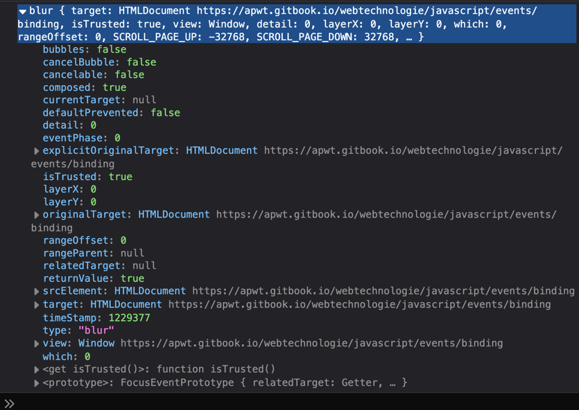

---
metaLinks:
  alternates:
    - https://app.gitbook.com/s/CyMmymf8tiNQ4Ws9WmHV/javascript/events/binding
---

# event binding

Een event aan een DOM-node koppelen noemen we **event binding**. Er zijn drie manieren om dit te doen, maar in de praktijk gebruiken we enkel **event listeners**. De andere methoden zijn verouderd.

## Event listeners

Elke DOM-node heeft een methode `addEventListener()` met twee verplichte parameters: het **type event** en de **callback-functie** die uitgevoerd wordt wanneer het event plaatsvindt.

```js
function checkUsername() {
    // code to check username
}

let elUsername = document.querySelector('#username');
elUsername.addEventListener('blur', checkUsername);
```

### Het event object

Wanneer een event plaatsvindt, krijgt de callback-functie automatisch een **event object** mee. Dit object bevat informatie over het event: het type, het element waarop het plaatsvond, enzovoort.

```js
elUsername.addEventListener('blur', (event) => {
    console.log(event);
});
```



[MDN: Events - Web APIs (EventTarget / addEventListener)](https://developer.mozilla.org/en-US/docs/Web/API/EventTarget/addEventListener)


Wil je niet langer naar een event luisteren? Gebruik dan [removeEventListener()](https://developer.mozilla.org/en-US/docs/Web/API/EventTarget/removeEventListener) om de listener te verwijderen.


## Belangrijke eigenschappen van het event object

### `event.target`

De `target` property verwijst naar het element waarop het event heeft plaatsgevonden. Handig wanneer je dezelfde handler gebruikt voor meerdere elementen.

```js
let formEl = document.querySelector('form');

formEl.addEventListener('submit', (event) => {
    console.log(event.target); // het formulier-element
    const usernameValue = event.target.querySelector('input#username').value;
    console.log(usernameValue);
});
```

### `event.currentTarget`

Terwijl `event.target` verwijst naar het element waarop het event **plaatsvond**, verwijst `event.currentTarget` naar het element waarop de **listener geregistreerd staat**. Dit verschil wordt pas duidelijk bij bubbling.

```js
let ul = document.querySelector('ul');

ul.addEventListener('click', (event) => {
    console.log(event.target);        // de <li> waarop geklikt werd
    console.log(event.currentTarget); // altijd de <ul> zelf
});
```

Dit patroon — één listener op een parent plaatsen in plaats van op elk kind afzonderlijk — noemen we **event delegation**. Het is efficiënter en werkt ook voor elementen die later dynamisch worden toegevoegd.

### `event.type`

Geeft het type event terug als string. Handig wanneer één handler meerdere eventtypes afhandelt.

```js
function handleInput(event) {
    console.log(event.type); // "focus", "blur", "input", ...
}

inputEl.addEventListener('focus', handleInput);
inputEl.addEventListener('blur', handleInput);
```

### `event.preventDefault()`

Stopt de standaardactie van een element — de browser volgt een link niet, of verstuurt een formulier niet.

```js
let aElement = document.querySelector('a');

aElement.addEventListener('click', (event) => {
    event.preventDefault();
    window.location = 'https://www.youtube.com/watch?v=Aq5WXmQQooo';
});
```

[Meer info over preventDefault op MDN](https://developer.mozilla.org/en-US/docs/Web/API/Event/preventDefault)

### `event.stopPropagation()` en `event.stopImmediatePropagation()`

Zie de sectie **Event bubbling en capturing** hieronder.

***

## Properties per eventtype

### Muis-events (`click`, `mousemove`, `mouseenter`, …)

| Property                                                              | Beschrijving                                                          |
| --------------------------------------------------------------------- | --------------------------------------------------------------------- |
| `event.clientX` / `event.clientY`                                     | Coördinaten t.o.v. het browservenster                                 |
| `event.pageX` / `event.pageY`                                         | Coördinaten t.o.v. de volledige pagina (inclusief scroll)             |
| `event.button`                                                        | Welke muisknop ingedrukt was: `0` = links, `1` = midden, `2` = rechts |
| `event.altKey` / `event.ctrlKey` / `event.shiftKey` / `event.metaKey` | Waren deze toetsen ingedrukt tijdens het event?                       |

```js
document.addEventListener('click', (event) => {
    console.log(event.clientX, event.clientY); // positie van de klik
    if (event.shiftKey) {
        console.log('Shift was ingedrukt tijdens het klikken');
    }
});
```

### Toetsenbord-events (`keydown`, `keyup`)

| Property       | Beschrijving                                                   |
| -------------- | -------------------------------------------------------------- |
| `event.key`    | De toets als leesbare string: `"Enter"`, `"ArrowUp"`, `"a"`, … |
| `event.repeat` | `true` als de toets ingehouden wordt                           |

```js
document.addEventListener('keydown', (event) => {
    if (event.key === 'Enter') {
        console.log('Enter ingedrukt');
    }
    if (event.repeat) {
        console.log('Toets wordt ingehouden');
    }
});
```

### Formulier-events

Bij formulier-events werk je vaak rechtstreeks op `event.target` om de waarde van een veld op te halen:

| Property                | Beschrijving                                                  |
| ----------------------- | ------------------------------------------------------------- |
| `event.target.value`    | De huidige waarde van een `<input>` of `<textarea>`           |
| `event.target.checked`  | De toestand van een checkbox of radio button (`true`/`false`) |
| `event.target.elements` | Alle form-elementen, als het target een `<form>` is           |

```js
let checkboxEl = document.querySelector('input[type="checkbox"]');

checkboxEl.addEventListener('change', (event) => {
    console.log(event.target.checked); // true of false
});
```

***

## Event bubbling en capturing

Wanneer een event plaatsvindt op een element dat zich binnen andere elementen bevindt, doorloopt het event twee fasen:

1. **Capturing**: het event reist van de root naar het doelelement (van boven naar beneden)
2. **Bubbling**: het event reist daarna terug omhoog naar de root (van beneden naar boven)

Standaard registreren event listeners zich voor de **bubbling fase**. Wil je een listener in de capturing fase laten reageren, geef dan `true` mee als derde argument:

```js
element.addEventListener('click', handler, true);  // capturing
element.addEventListener('click', handler, false); // bubbling (standaard)
```

### Verspreiding stoppen

Wil je voorkomen dat een event verder reist door de DOM, gebruik dan `stopPropagation()`:

```js
button.addEventListener('click', (event) => {
    event.stopPropagation(); // parent-handlers worden niet meer aangeroepen
});
```

Wil je ook voorkomen dat andere listeners op **hetzelfde element** nog worden uitgevoerd, gebruik dan `stopImmediatePropagation()`:

```js
button.addEventListener('click', (event) => {
    event.stopImmediatePropagation();
});
```

***

## Verouderde methoden (niet meer gebruiken)

### DOM event handlers

De oorspronkelijke manier om events te koppelen via DOM-properties. Het grote nadeel: je kan **slechts één functie** aan een event koppelen.

```js
let elUsername = document.querySelector('#username');
elUsername.onblur = checkUsername;
```

### HTML event handlers

Events koppelen via HTML-attributen. Vermijd dit — het doorbreekt de scheiding tussen structuur (HTML) en gedrag (JavaScript).

```html
<input type="text" id="username" onblur="checkUsername()">
```
