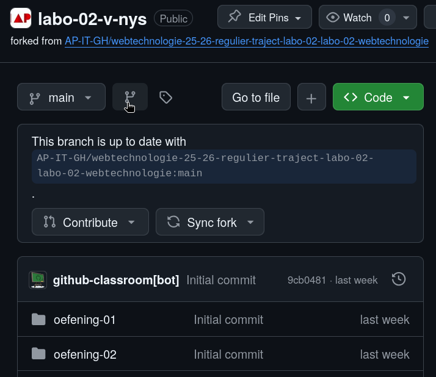
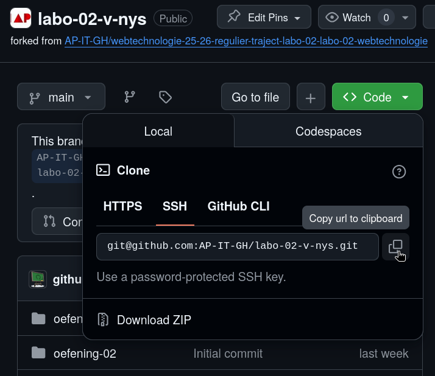

# Hoe werken we in de labo's?

## Stap 1: Start via GitHub Classroom
Voor elk labo krijg je een **GitHub Classroom-link**. Deze zijn terug te vinden in de labo-pagina's (bv. [Labo 1](oefeningen/labo1/oefeningen.md), [Labo 2](oefeningen/labo2/oefeningen.md), ...).
Klik op de link van het labo dat je wil starten. Aanvaard de opdracht voor dat labo. Het kan zijn dat je eerst een Github account moet aanmaken.

  
*GitHub Classroom nadat je jouw repo hebt aangemaakt. Via de URL kom je op jouw persoonlijke repository.*

---

## Stap 2: IDE in orde brengen (éénmalig)
- Installeer **Visual Studio Code** en de nodige extensies (zie hoofdstuk [IDE](/ide.md)).
- Maak op je computer een mapje voor het vak (bv. `webtechnologie`).
---

## Stap 3: Git installeren (éénmalig)
Indien je Git nog niet op je systeem hebt, ga je naar [git-scm.org](https://git-scm.com/) en download je daar Git. De installatieprocedure wordt [hier](https://mrcloudbook.com/1932-2/) omschreven, onder "Install Git on Windows via GUI". **Kies bij stap 7 Visual Studio Code als text editor.** Je hoeft het niet opnieuw te installeren via CMD!

Open hierna het programma "Git Bash" dat nu op je systeem staat en voer één voor één volgende twee regels in. **Pas aan met je eigen naam en e-mail.**

```
git config --global user.name "voornaam familienaam"
git config --global user.email "voornaam.familienaam@student.ap.be"
```

Heb je een fout gemaakt? Dan mag je deze regels gewoon opnieuw invoeren.

## Stap 4: SSH-sleutel aanmaken en registreren op Github (éénmalig)
Nu gaan we een digitaal slot en een sleutel maken waarmee je je identiteit kan bewijzen. De details zijn niet zo belangrijk hier, je moet gewoon de instructies volgen zodat je de opdrachten kan uitvoeren.

Vul in Git Bash volgende regel in: `ssh-keygen -t rsa`. Je mag overal de defaultwaarden kiezen. De "passphrase" mag je leeg laten.

Door deze stappen te doorlopen, maak je twee files. De locatie van deze files wordt vermeld in je venster. Waarschijnlijk is het `C:/Users/jouwgebruikersnaam/.ssh`. De twee files hebben dezelfde naam, maar één ervan eindigt op `.pub`. Die gaan we registreren in Github.

Hiervoor doe je het volgende:

1. zorg dat je ingelogd bent op [github.com](https://github.com)
2. klik op je icoontje rechts boven
3. klik op "settings"
4. klik in het menu links op "SSH and GPG keys"
5. klik op "new SSH key"
6. geef een titel naar keuze (bijvoorbeeld "mijn schoollaptop")
7. plak in het grote veld "key" de inhoud van de eerder aangemaakte file die op `.pub` eindigt (je kan deze file openen in Visual Studio Code, **niet** in Microsoft Publisher)

## Stap 5: Je repository clonen 

- Ga in Git Bash naar je mapje voor het vak Webtechnologie. Je kan dit bijvoorbeeld doen door in je Windows Verkenner in dat mapje te gaan staan en in de witruimte naast de adresbalk te klikken. Kopieer dan die tekst. Dat zal dan bijvoorbeeld "C:/Users/mijnnaam/School/2025-2026/Webtechnologie" zijn (afhankelijk van waar je het gezet hebt). Typ in Git bash de letters `cd` gevolgd door wat je gekopieerd hebt, tussen aanhalingstekens. Bijvoorbeeld `cd "C:/Users/mijnnaam/School/2025-2026/Webtechnologie"`. Duw op Enter.
- Bezoek nu je Github Classroom link
- Je zal iets zien zoals dit: 
- Klik op de groene knop "Code", let erop dat de optie "SSH" aangeduid is en kopieer dan via de knop de URI: 
- Zet dit in hetzelfde Git Bash venster van eerder: `git clone plak-hier-de-tekst-die-je-gekopieerd-hebt-van-de-website`

> 💡 **Tip:** In de cursus IT Essentials vind je meer uitleg bij [Git > Remote Repositories en Samenwerken](https://apwt.gitbook.io/it-essentials/git/collaborating).

---

## Stap 6: Tijdens het labo
Open je labo en volg dit stappenplan:

1. Open **Visual Studio Code** en selecteer de map van het labo (de map die je gecloned hebt).
2. Start de **Live Server-extensie** via de knop *Go Live*.
3. Open het HTML-bestand in je browser.
   > Meestal vind je dit op `http://localhost:5500` (het poortnummer kan verschillen).
4. Volg de instructies van de oefening.
5. Maak **regelmatig commits** en **push** je werk naar GitHub:

```bash
    git add .
    git commit -m "Beschrijving van je wijzigingen"
    git push origin main
```

---

## Verwachtingen
- Maak **regelmatig commits** (bv. na elke oefening of belangrijke wijziging).
- Gebruik **duidelijke commit messages**.
  > Voorbeeld: `Oefening 3 afgewerkt` is beter dan `update`.
- Push je werk **op tijd**.

> **Veelgemaakte fout:** Vergeet niet `git add .` te doen **voor** je een commit maakt.

---

## Handige weetjes
- Je kan je repo altijd opnieuw **clonen** op een andere computer.
- Je vooruitgang is zichtbaar in de **commit history**.
- Bij vragen of problemen: contacteer de lector of gebruik het afgesproken communicatiekanaal.

---

## Waarom werken we met GitHub Classroom?
- Je leert al doende werken met **git**.
- Je oefeningen staan veilig online als **back-up**.
- De lectoren kunnen je werk makkelijk **nakijken** bij vragen of problemen.
- Je ziet je **evolutie** in de commit history.
