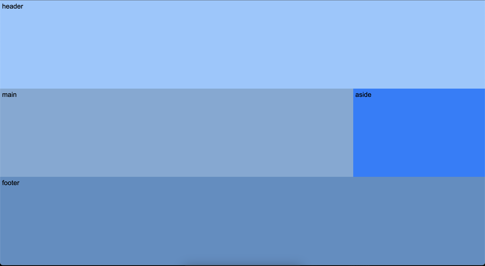
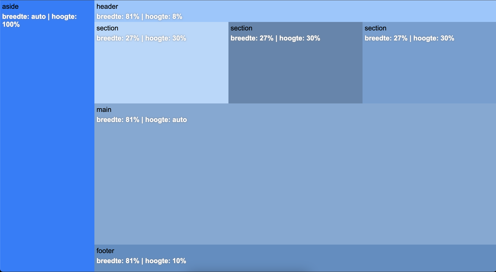
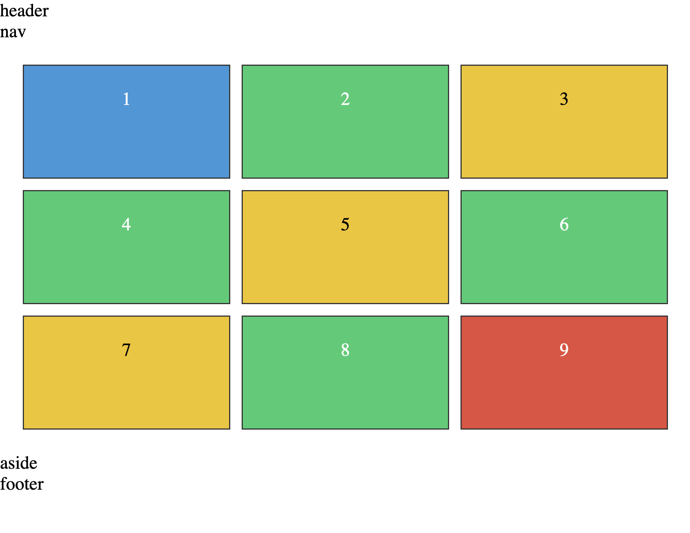

# Oefeningen labo 5


Voor deze oefeningen vertrek je telkens met een gelinkt reset.css bestand op basis van [The New CSS Reset](https://elad2412.github.io/the-new-css-reset/).

Zorg dat je de volgende folder structuur volgt:

```
webtechnologie/
├─ labo-01/
│  ├─ oefening-01/
│  │  ├─ index.html
│  │  ├─ images/
│  │  │  ├─ image-1.jpg 
│  │  │  ├─ image-n.jpg 
│  │  ├─ css/
│  │  │  ├─ reset.css
│  │  │  ├─ style.css
│  ├─ oefening-02/
│  ├─ oefening-n/
├─ labo-02/
├─ labo-n/      
```

## oefening 1

Bouw het volgende ontwerp na met behulp van een CSS Grid en grid-template-areas



* Zorg dat de body-tag altijd minstens `100vh` hoog is.
* Voeg de volgende elementen toe aan de body van je `index.html` pagina.
  * header
  * main
  * aside
  * footer
* Zorg dat elk van deze elementen 5px padding heeft (volledig rondom) 
* Zorg dat de naam van elk element in het bijhorende element staat. Geef ze het lettertype `Arial` en zorg voor een fallback naar eender welk `sans-serif` font.
* selecteer deze elementen vanuit CSS met type-selectors
* geef de volgende achtergrondkleuren aan elk element: 
  * header: `#91c8ff`
  * main: `#7da9d5`
  * aside: `#007fff`
  * footer: `#588ec3`
* geef elk element een naam (met de property `grid-area`) zodat je ze kunt gebruiken in een grid.
* selecteer de parent van de voorgaande elementen met een type-selector en pas het grid toe. Let daarbij dat de aside 1/4 van de schermbreedte inneemt.

## oefening 2


* Kopieer je oplossing van oefening 1 en voeg een nav-element toe binnen de header
* Geef de nav de achtergrondkleur `#b3d8fd`
* Zorg dat de naam van het element in het nav-element staat
* Zorg ervoor dat de header op zijn beurt ook een grid-parent wordt (dus zowel een grid-child van de body als een grid-parent van de nav)
* Zorg dat de navbar 250px breed is en rechts uitgelijnd staat
  > **TIP**: gebruik hiervoor `grid-template-columns`
* Zorg ervoor dat het nav-element slechts zo hoog is als de inhoud ervan
  > **TIP**: gebruik hiervoor `align-self`

## oefening 3



Maak het voorgaande ontwerp na en maak opnieuw gebruik van grid-template-areas in combinatie met
* grid-template-columns (Zie design voor de breedte percentages) 
* grid-template-rows (Zie design voor hoogte percentages)
* Benoem elke grid-template-area afzonderlijk en geef elk een achtergrondkleur:
  * sidebar: `#007fff`
  * header: `#91c8ff`
  * section1: `#b3d8fd` 
  * section2: `#5e86af` 
  * section3: `#6d9fd2` 
  * main: `#7da9d5`
  * footer: `#588ec3`
* Elk section is een aparte grid-area. Maak gebruik van child pseudoklassen om de 3 sections naast elkaar te zetten.

## oefening 4

Bouw het onderstaande grid na:



* Maak een HTML-pagina met een `head` en een `body`-sectie.
* Gebruik de volgende elementen om de structuur van de pagina te definiëren:
  * header
  * nav
  * main
  * aside 
  * footer
* Gebruik het main-element om het raster van items te bevatten.
* Voeg binnen het main-element 9 article-elementen toe. Deze elementen vormen de items in het grid.
* Geef de 9 article-elementen een rand om ze van elkaar te scheiden.
* Selecteer het main element in CSS en maak hiervan een grid-parent
* Gebruik de `grid-template-columns` en `grid-template-rows` eigenschappen om het aantal kolommen en rijen en hun grootte in te stellen:
  * Breedte van elk article element: 1/3 van de schermbreedte 
  * Hoogte van elk article: 100px;
* Voorzie een gap van 10px tussen de articles.
* Gebruik :first-child, :last-child, :nth-of-type, :nth-child(even), en :nth- child(odd) om verschillende stijlen toe te passen op specifieke items in het raster:
  * Geef het eerste article een blauwe (`#3498db`) achtergrondkleur
  * Geef het laatste article een rode (`#e74c3c`) achtergrondkleur
  * Geef alle even articles een groene (`#2ecc71`) achtergrondkleur
  * Geef alle oneven articles een gele (`#f1c40f`) achtergrondkleur.
* Zet een nummer in elk article. Zorg ervoor dat het nummer goed leesbaar is (gebruik een witte tekst op de rode, groene en blauwe achtergrondkleur en een zwarte tekst op de gele achtergrondkleur).
