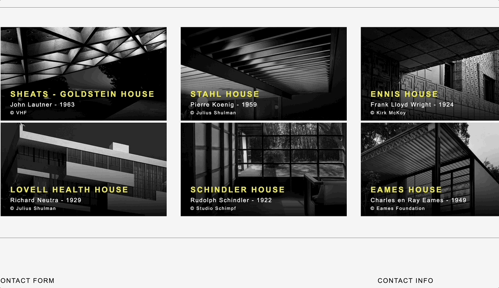

# Oefeningen labo 11

Zorg dat je de volgende folder structuur volgt:

```
webtechnologie/
├─ labo-01/
│  ├─ oefening-01/
│  │  ├─ index.html
│  │  ├─ images/
│  │  │  ├─ image-1.jpg 
│  │  │  ├─ image-n.jpg 
│  │  ├─ css/
│  │  │  ├─ reset.css
│  │  │  ├─ style.css
│  ├─ oefening-02/
│  ├─ oefening-n/
├─ labo-02/
├─ labo-n/      
```

## Geïntegreerde opdracht

Dit is een grote herhalingsoefening waar de meeste topics van het voorbije trimester in terugkomen. Deze herhalingsoefening is een ideale oefening om jezelf of je voldoende voorbereid bent voor de tussentijdse toets.
Voor deze oefening maak je gebruik van de volgende startbestanden:


startbestanden geïntegreerde opdracht



Jou taak is om de volgende _one-pager_ responsive (mobile-first OF desktop-first) op te bouwen.
Test jouw website op responsiviteit, zodat die werkt op alle schermgroottes.

<div style="display: flex; justify-content: space-between;">
<figure>
  <picture>
    
  </picture>
  <figcaption>Mobile result (768px wide screen)</figcaption>
</figure>

<figure>
  <picture>
    
  </picture>
  <figcaption>Tablet result (1280px wide screen)</figcaption>
</figure>

<figure>
  <picture>
    
  </picture>
  <figcaption>Desktop result (1920px wide screen)</figcaption>
</figure>
</div>


### Requirements: 

#### HTML

- Maak gebruik van semantische elementen waar mogelijk (header, nav, main, section, article, aside en footer)
- De header met nav bevat:
  - het logo met daarover een link naar de homepage
  - een navbar met 3 elementen: 
        - home (link naar section met id="home")
        - portfolio (link naar section met id="portfolio")
        - contact (link naar section met id="contact")
  - een zoekbalk
- Teaser section (section met id="teaser) bestaat uit een hoofdtitel met op de achtergrond een afbeelding
- Home section (section met id="home") bestaat uit twee kolommen:
  - Kolom links
    - een ondertitel 
    - een paragraaf met een aantal links die naar "nergens" wijzen (href="#")
    - een tweede paragraaf zonder links
  - Kolom rechts
    - een ondertitel 
    - een paragraaf 
    - een tweede paragraaf met een link naar de contactgegevens onderaan de pagina
  - Portfolio section (section met id="portfolio")
    - een flexbox waarin 3 items naast elkaar passen op desktop.
    - de flex-items moeten naar de volgende lijn geduwd worden wanneer de minimum breedte niet gegarandeerd kan worden.
- Contact section (section met id="contact)
  - Rechts staat de contact info
  - Onderaan staan de social media icons met links (href="#")
- Footer
  - Footertekst
  - ©-symbool wordt geschreven als HTML-entiteit.

#### CSS

- Maak gebruik van een reset.css
- De algemene layout van de website staat in een grid
- Binnen sections zoals portfolio kan flex gebruikt worden
- Gebruik als font "Arial", "Helvetica", sans-serif
- Gebruik de volgende kleurenvariabelen:
  - achtergrondkleur (`--bg-color`) = `rgb(244,244,244)`,
  - h1 (`--secondary-color`) = `rgb(231,227,79)`
  - h2 (`--primary-color`) = `rgb(18,18,18)`
  - p (`--tertiary-color`) = `rgb(100, 100, 100)`
  - a (`--link-color`) = `rgb(149, 147, 100)`
- Zorg voor de volgende subtiele animatie wanneer de gebruiker over de portfolio-items hovert


  


