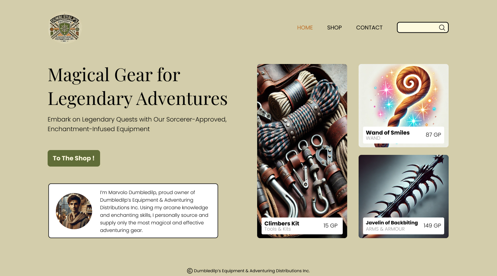

# Algemene info

## Algemene Info

Op deze pagina vind je alle informatie over de projectopdracht die je gedurende het semester zal uitvoeren. De projectopdracht bestaat uit verschillende deelopdrachten die je stap voor stap zal uitvoeren. Je zal een volledige, responsieve webshop bouwen voor een fictief bedrijf. De webshop zal verschillende pagina's bevatten, waaronder een homepage, productpagina's, een contactpagina, en een werkend winkelmandje.

## Deelopdrachten

De projectopdracht is opgedeeld in **7 deelopdrachten**:

1. [Concept & content](deelopdracht-1-concept-content.md)
2. [Development mobiele website met HTML en CSS](deelopdracht-2-opbouw-html-css.md)
3. [Development responsive webshop](deelopdracht-3-development-responsive.md)
4. [Contact page formulier](deelopdracht-4-contact-page-formulier.md)
5. [Winkelmandje & wishlist](deelopdracht-5-winkelmandje-wishlist.md)
6. [Contact page kaartje](deelopdracht-6-contact-page-kaart.md)
7. [Dynamische content](deelopdracht-7-dynamische-content.md)

Elke deelopdracht bouwt voort op de vorige. Zorg ervoor dat je elke deelopdracht grondig doorneemt en uitvoert.

## Wireframes

De wireframes van de webshop zijn terug te vinden op [deze Figma Community Page](https://www.figma.com/community/file/1476954261247826487).

* Klik "Open in Figma", en maak een account aan.
* Deze Figma file bestaat uit 3 pagina's:
  * Mobile
  * Desktop
  * ~~Components~~ (enkel nuttig voor de ontwerper aka. de lector)

Bekijk de wireframes steeds op Figma, gezien ze nog geüpdatet kunnen worden doorheen het semester. De wireframes zijn een hulpmiddel, geen strikte regel. De geschreven opdracht in dit document is steeds leidend.

## Mobile-First

We werken volgens het **mobile-first** principe. Dit betekent dat je de website in eerste instantie optimaliseert voor **smartphones**. In een latere fase (deelopdracht 3) zal je ook optimalisaties toevoegen voor **tablets, laptops en desktops**.

## Copywriting

* Alle teksten voor je webshop moeten **in het Nederlands** worden geschreven.
* Vermijd schrijffouten. Gebruik spellingscorrectie.
* **Kopieer geen teksten** van het internet waar copyright op rust. Zorg ervoor dat je originele teksten gebruikt.
* **AI Tools**: Maak gerust gebruik van AI, zoals **ChatGPT**, om teksten te genereren of inspiratie op te doen.
* Houdt teksten beknopt en helder.
* Laat je tekst op het laatste eens nalezen door een andere persoon.

## Afbeeldingen

### Rechtenvrije Afbeeldingen

* Gebruik **enkel rechtenvrije afbeeldingen** die je zelf hebt gemaakt of die beschikbaar zijn via platforms met een vrije licentie, zoals:
  * [Unsplash](https://unsplash.com/)
  * [Pexels](https://www.pexels.com/)
  * [Pixabay](https://pixabay.com/)
* **Tip:** Kun je geen perfecte afbeelding vinden voor je product? Kies dan voor een meer generieke afbeelding die het idee van je product goed weergeeft. Bijv. voor een webshop die voetbalschoenen verkoopt, kun je zoeken naar generieke, rechtenvrije foto's van voetbalschoenen.
* Afbeeldingen gegenereerd met AI kunnen ook, maar probeer origineel te zijn.

### Bronvermelding

* **Voeg altijd een bronvermelding toe** bij rechtenvrije afbeeldingen in de `figcaption` van de afbeelding. Dit is een vriendelijke geste naar de fotograaf en maakt het gemakkelijk voor de lectoren om de bron te verifiëren, en stelt ons in staat om te controleren waar jij je afbeeldingen vandaan hebt gehaald.
* Zorg ervoor dat elke afbeelding een **duidelijke bestandsnaam** heeft, bijv. `product-zaadjes-lavendel.jpg`.
* Zorg voor een goede organisatie van foto's in een mappenstructuur.

### Afbeelding Resizing & Aspect-Ratio's

*   Gebruik gratis tools zoals:

    * [⭐️ Photopea](https://www.photopea.com/)
    * [Canva](https://www.canva.com/nl_nl/)
    * [Adobe Express](https://www.adobe.com/express/feature/image/resize)
    * [Imagy.app](https://imagy.app/)

    om je afbeeldingen bij te snijden naar de juiste afmetingen en **aspect-ratio's**.
* Voor productfoto's: ga voor vierkante images van 500x500px.

## Coding Guidelines

Zorg ervoor dat alle code die je schrijft voldoet aan de [Coding Guidelines](../coding-guidelines.md). Volg deze richtlijnen zorgvuldig om een consistente en professionele webshop te bouwen.
