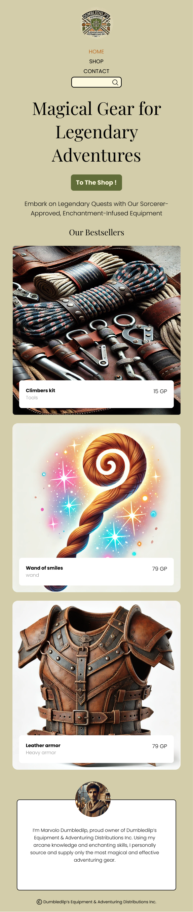

# Deelopdracht 2 - Mobiele website met HTML en CSS

<figure>
  
  <figcaption>Tijdens deze deelopdracht werk je je webshop uit op een mobiel apparaat</figcaption>
</figure>

Lees voor je begint zeker de [algemene info](info.md) door. Hier vind je alle informatie over de projectopdracht, de deelopdrachten en de designs.

In deze deelopdracht ga je de **mobiele** webpagina's van de webshop bouwen. Zorg ervoor dat je browservenster is ingesteld als een gangbaar smartphone scherm en voer de stappen in dit document uit. Volg hierbij altijd de [designs](info.md#designs), maar pas deze ontwerpen tijdens het implementeren aan op basis van de styleguide die je hebt geschreven tijdens [deelopdracht 1](deelopdracht-1-concept-content.md).

---

## 1. Mappenstructuur & bestanden

Maak de volgende mappenstructuur aan:

```
projectopdracht-webtechnologie-<je naam>/
├─ index.html
├─ shop.html
├─ contact.html
├─ product-<naam>.html
├─ css/
│  ├─ general.css
│  ├─ home.css
│  ├─ normalize.css
│  ├─ shop.css
│  ├─ product.css
│  └─ contact.css
├─ assets/
│  └─ images/
│     ├─ foto-1.jpg
│     ├─ foto-2.jpg
│     └─ foto-3.jpg
└─ js/
```

### HTML-pagina's

Maak de volgende HTML-pagina's aan:

- `index.html`
- `shop.html`
- `product-<naam>.html` (minimaal 6 pagina's, één per product)
- `contact.html`

### CSS-bestanden

- Eén CSS-bestand voor de algemene opmaak: `general.css`.
- Een apart CSS-bestand per pagina voor pagina-specifieke opmaak: `home.css`, `shop.css`, `product.css`, `contact.css`.
- Kies zelf of je `normalize.css` of `reset.css` gebruikt, en voeg dit bestand toe aan de map `css/`. Zorg dat je zeker het verschil tussen de twee kent, want je moet je keuze kunnen toelichten tijdens de mondelinge verdediging.

Link elke HTML-pagina met de juiste CSS-bestanden. `index.html` heeft bijvoorbeeld 3 `<link>`-tags: je reset/normalize-bestand, `general.css` en `home.css`.

> **TIP**: Houd de volgorde van de CSS-bestanden aan: eerst de reset of normalize, daarna `general.css` en vervolgens de pagina-specifieke CSS.

---

## 2. Algemene features (op elke pagina)

Elke pagina moet dezelfde algemene elementen bevatten:

- Typografie: lettertype, font-size, headings (h1, h2, h3, ...)
- Een header met een logo
- Navigatie in de header met links naar de andere pagina's
- Een footer

> **TIPS**:
> - Bouw de algemene features eerst op één pagina (bijvoorbeeld `index.html`). Kopieer deze HTML pas naar de andere pagina's wanneer ze klaar zijn. Omdat `general.css` op elke pagina gelinkt is, blijft de styling overal hetzelfde — dit bespaart tijd en zorgt voor uniformiteit.
> - Gebruik op elke pagina de juiste semantische elementen (`header`, `nav`, `main`, `aside`, `section`, `article`, `footer`, ...) zoals gezien in de les.

---

## 3. Pagina-specifieke features

### `index.html` — de homepage

- Naam van de webshop in een `h1`.
- Algemene uitleg over je webshop, zoals beschreven in je styleguide uit deelopdracht 1.
- Een CTA (call-to-action) knop die linkt naar de shop (tip: style de `a`-tag met CSS als een button).
- Kaartjes met de 3 best verkochte producten (gebruik een `article` per kaartje):
  - Gebruik de CSS-property `background-image` om de foto op de achtergrond te plaatsen.
  - Voeg met flexbox een kadertje toe in het kaartje met de titel en de korte beschrijving.
- Een "bio"-kaartje met:
  - Een professionele foto van jezelf (gebruik negatieve padding of margin om de foto wat naar boven te duwen zodat deze bovenaan uitsteekt).
  - Een korte uitleg of bio van jezelf.

### `shop.html` — het overzicht van alle producten

- Een `h2` titel.
- Een `aside` voor de wishlist en voor de shopping cart. Deze mogen in deze fase nog leeg zijn.
- 6 productkaartjes (gebruik een `article` per kaartje), onder elkaar geplaatst, met elk:
  - Een titel (`h3`).
  - Een korte beschrijving, gebaseerd op de productbeschrijving uit deelopdracht 1.
  - Een foto van het product (gebruik `background-image`).
  - Een button om het product toe te voegen aan je winkelmandje (moet nog niet werken).

### 6 detailpagina's — één per product

- Een titel.
- Een beschrijving.
- Een afbeelding in een `figure`, met de bronvermelding in de `figcaption`.
- Een opsomming met minstens 5 productspecificaties.
- Een button om het product toe te voegen aan je wishlist.

> **TIP**:
> Werk 1 detailpagina volledig uit, en kopieer deze naar de andere 5 detailpagina's als je helemaal klaar bent. Pas enkel de content aan (titel, beschrijving, afbeelding, specificaties).


### `contact.html`

Voorzie de pagina met alle algemene features, maar laat de `main` voorlopig leeg. Het contactformulier volgt in [deelopdracht 4](deelopdracht-4-contact-page-formulier.md).
