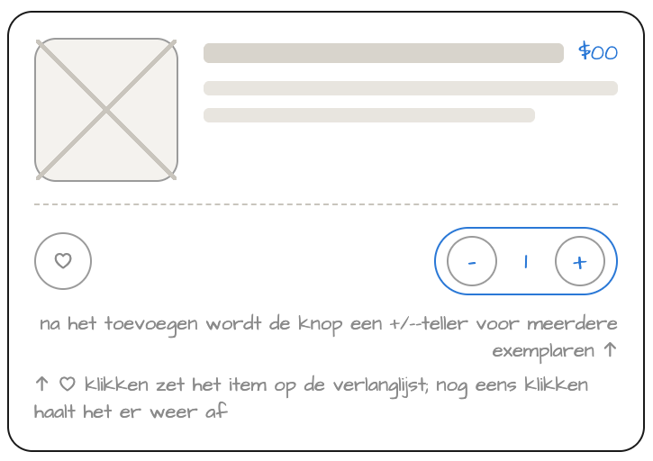
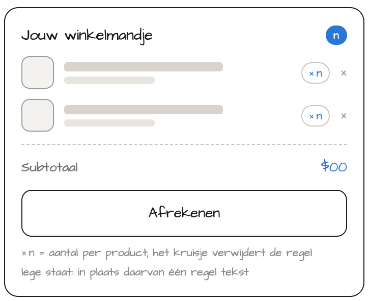
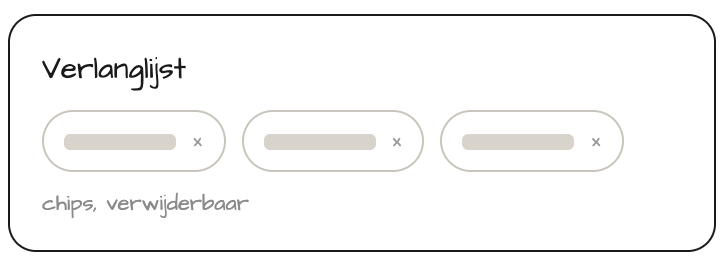

# Deelopdracht 5 - Winkelmandje en verlanglijst

Lees eerst de [Projectinformatie](info.md). Daar vind je de wireframes, de deadlines en de regels voor het hele project.

In deze deelopdracht maak je de shoppagina interactief. Een bezoeker kan:

- producten toevoegen aan het winkelmandje en het aantal aanpassen;
- producten bewaren in de verlanglijst;
- een bestelling bevestigen.

Dat gebeurt enkel op de shoppagina. Op de detailpagina's staan geen knoppen om iets toe te voegen.

<figure><figcaption>Het winkelmandje, de bevestigingsdialoog en de verlanglijst staan boven de zes producten</figcaption></figure>


Alle elementen, toestanden en interacties op de wireframes zijn **verplicht**. De kleine grijze notities leggen enkel het gedrag uit. Er zijn geen bonus-features voor deze deelopdracht.


---

## 1. Producten toevoegen en aantallen aanpassen

Elk productkaartje heeft een hartje en een knop **In winkelmandje**.

- Een klik op **In winkelmandje** voegt één exemplaar toe aan het winkelmandje.
- De knop verandert daarna in een teller: een **−-knop**, het aantal en een **+-knop**.
- **+** voegt één exemplaar toe, **−** verwijdert er één.
- Bij 0 verdwijnt het product uit het winkelmandje en verschijnt de knop **In winkelmandje** opnieuw.
- De teller op het kaartje en het aantal in het winkelmandje zijn altijd gelijk.

---

## 2. Winkelmandje

Het winkelmandje staat bovenaan op mobiel en rechts van de producten op desktop.

- Elk gekozen product staat één keer in de lijst, met een kleine afbeelding, de naam, de prijs en het aantal (bv. ×3).
- Het bolletje naast de titel toont het totale aantal exemplaren.
- Het **subtotaal** is de som van prijs × aantal van alle producten.
- Elke productregel heeft een **×-knop** die alle exemplaren van dat product verwijdert. Op het productkaartje verschijnt dan opnieuw **In winkelmandje**.
- Is het winkelmandje leeg, dan toon je een korte melding, bv. _Je winkelmandje is leeg._
- Onder het subtotaal staat de knop **Afrekenen**. Die opent de dialoog uit stap 4.

Het bolletje en het subtotaal worden na elke wijziging automatisch bijgewerkt.

---

## 3. Verlanglijst

De verlanglijst staat onder het winkelmandje.

- Een klik op het hartje voegt het product toe aan de verlanglijst en kleurt het hartje in.
- Het product verschijnt in de verlanglijst als een _chip_ met de productnaam.
- Een tweede klik op het hartje verwijdert het product weer en maakt het hartje leeg.
- Elke chip heeft een **×-knop** die het product verwijdert en het hartje leeg maakt.
- Het hartje en de verlanglijst zijn altijd met elkaar in overeenstemming.

---

## 4. Bestelling bevestigen

<figure><figcaption>De dialoog "Bestelling bevestigen" staat rechts onderaan in de desktop-wireframe</figcaption></figure>

**Afrekenen** opent een modale dialoog. De rest van de pagina wordt verduisterd.

- De dialoog heeft de titel **Bestelling bevestigen** en een **×-knop** om hem te sluiten zonder te bestellen.
- Toon alle producten uit het winkelmandje met naam, aantal en prijs, en daaronder de totale prijs.
- Onderaan staat de knop **Bestelling plaatsen**.
- Na een klik daarop toon je een bevestiging in de dialoog, bv. _✓ Bestelling geplaatst_, en sluit je de dialoog automatisch (bv. met `setTimeout`).

---

## 5. Mobiel en desktop

Alles werkt op mobiel en op desktop. Wisselt de pagina via een media query van lay-out, dan blijven inhoud en werking hetzelfde.

---

## Tips

- Bouw alles stap voor stap op. Controleer na elke actie of alle aantallen, prijzen en knoppen mee veranderen.
- Gebruik een `ul` voor de productregels in het winkelmandje en voor de chips in de verlanglijst.
- Houd per product één duidelijke toestand bij: minstens een id, de prijs, het aantal en of het in de verlanglijst staat.
- Test ook randgevallen: een leeg winkelmandje, verwijderen via een ×-knop en daarna hetzelfde product opnieuw toevoegen.
