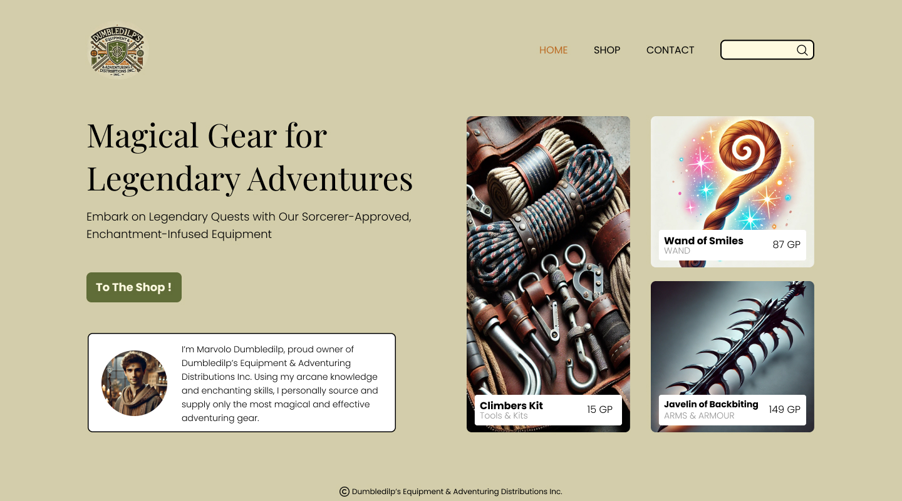

# Projectopdracht

## Algemene Info

Op deze pagina vind je alle informatie over de projectopdracht die je gedurende het semester zal uitvoeren. De projectopdracht bestaat uit verschillende deelopdrachten die je stap voor stap zal uitvoeren.
Je zal een volledige, responsieve webshop bouwen voor een fictieve organisatie. De webshop zal verschillende pagina's bevatten, waaronder een homepage, productpagina's, een contactpagina, en een werkend winkelmandje.

###  GitHub repository

Je zal je project maken in een private repository onder de Github Organisation van dit vak. Hier zul je commits naar kunnen pushen
tot de finale deadline. Daarna wordt de repository afgesloten en kan je geen wijzigingen meer aanbrengen.

1. Maak een GitHub account aan met je AP e-mailadres of log in op je bestaande account. Heb je al een GitHub account met een persoonlijk e-mailadres, dan kan je jouw AP e-mailadres als secundair adres toevoegen aan je GitHub account in de instellingen.
2. Ga naar de [uitnodigingslink](https://github-inviter.vercel.app?key=i-love-html-12345) van onze Github Organisatie.
3. Vul je `ap.student.be` e-mailadres in en klik op **Request invite**.
4. Je ontvangt een e-mail van GitHub met een uitnodiging om lid te worden van de organisatie. Klik op **Join**.
5. Op Github klik je op je profielfoto rechtsboven en kies je voor **Your organizations**. Klik op de organisatie **webtechnologie-2027-2027**.
6. Klik op de tab **Repositories** en vervolgens op **New repository**.
7. Kies een naam voor je repository. Gebruik de volgende naamgevingsconventie: `projectopdracht-webtechnologie-<je naam>`. Vervang `<je naam>` door je eigen naam.
8. Kies voor een **Private** repository. De rest van de instellingen kan je op de standaardwaarden laten staan. Klik op **Create repository**.

### Planning

| Deel | Onderdeel                                                                         | Lesweek | Deadline                    | Feedback mogelijk? | Indienen via Digitap? |
|------|-----------------------------------------------------------------------------------|---------|-----------------------------|--------------------|-----------------------|
| 1    | [Concept & content](deelopdracht-1-concept-content.md)                            | LW1     | 08/02/2026 (aanbevolen)     | ❌                  | ❌                     |
| 2    | [Development mobiele website met HTML en CSS](deelopdracht-2-opbouw-html-css.md)  | LW2     | 22/02/2026 (aanbevolen)     | ❌                  | ❌                     |
| 3    | [Development responsive webshop](deelopdracht-3-development-responsive.md)        | LW5     | 12/03/2026                  | ✅                  | ✅                     | ✅
| 4    | [Contact page formulier](deelopdracht-4-contact-page-formulier.md)                | LW6     | 22/03/2026 (aanbevolen)     | ❌                  | ❌                     |
| 5    | [Winkelmandje & wishlist](deelopdracht-5-winkelmandje-wishlist.md)                | LW10    | 06/05/2026                  | ✅                  | ✅                     | ✅
| 6    | [Contact page kaartje](deelopdracht-6-contact-page-kaart.md)                      | LW11    | 10/05/2026 (aanbevolen)     | ❌                  | ❌                     |
| 7    | [**Dynamische content (finale inzending)**](deelopdracht-7-dynamische-content.md) | LW11    | **24/05/2026**              | ❌                  | ✅                     |
| 8    | Presentatie                                                                       | LW13    | Tijdens de laatste 2 lessen | ❌                  | ❌                     |

### Inleveren

Om correct in te dienen dien je de link naar je GitHub repository in te zenden
via [Digitap](https://learning.ap.be). Opgelet, enkel **private** repositories onder de Github organisatie van dit vak worden aanvaard.

Zorg dat je tijdig bent met indienen, want te late inzendingen worden niet aanvaard.

### Feedback

Je kan tussentijdse feedback krijgen van de lector na:

* Deel 3: volledige responsive webshop
* Deel 5: winkelmandje & wishlist

Voorwaarde: je moet je werk tijdig indienen via Digitap én je moet aanwezig zijn in de eerstvolgende les.

> Let op: feedback is inhoudelijk (geen punten) en helpt je om beter voorbereid te zijn voor de finale inzending.

### Presentatie en verdediging

Na je finale inzending kom je tijdens de laatste lesweek je webshop presenteren. Na je presentatie zul je
ook technische vragen over je werk moeten beantwoorden. Deelopdracht 7 vormt je finale inzending. Zorg dat je deze
inzending (via Digitap) zeker niet mist!

## Deelopdrachten

De projectopdracht is opgedeeld in **7 deelopdrachten** en wordt afgesloten met een presentatie. De deelopdrachten zijn:

1. [Concept & content](deelopdracht-1-concept-content.md)
2. [Development mobiele website met HTML en CSS](./deelopdracht-2-opbouw-html-css.md)
3. [Development responsive webshop](./deelopdracht-3-development-responsive.md)
4. [Contact page formulier](deelopdracht-4-contact-page-formulier.md)
5. [Winkelmandje & wishlist](./deelopdracht-5-winkelmandje-wishlist.md)
6. [Contact page kaartje](deelopdracht-6-contact-page-kaart.md)
7. [Dynamische content](deelopdracht-7-dynamische-content.md)

Elke deelopdracht bouwt voort op de vorige. Zorg ervoor dat je elke deelopdracht grondig doorneemt en uitvoert.

## Designs

Wanneer je een website bouwt vertrek je meestal vanaf een design. Vaak heeft een designer dit design gemaakt in een tool zoals Figma of Adobe XD. Als developer ga je dit design omzetten naar een werkende website.
Voor deze projectopdracht baseer je je op designs die we in Figma gemaakt hebben. Deze designs zet jij om naar HTML en CSS. Enkel het kleurgebruik, lettertype en content pas je aan naar hoe je ze bij de [eerste deelopdracht](deelopdracht-1-concept-content.md) hebt gedefinieerd.

Je vind de designs op deze [Figma Community Page](https://www.figma.com/community/file/1476954261247826487).
- Klik "Open in Figma", en maak een account aan.
- Deze Figma file bestaat uit 2 pagina's: de **mobile** en de **desktop** designs.



Opgelet: Hou je zo strikt mogelijk aan de afgeleverde designs (buiten kleuren, lettertype en content). Hoe goed jij de designs hebt omgezet naar HTML en CSS zal een groot deel van je eindscore bepalen (zie evaluatie).



## Mobile-First

We werken volgens het **mobile-first** principe. Dit betekent dat je de website in eerste instantie optimaliseert voor **smartphones**. In een latere fase (deelopdracht 3) zal je ook optimalisaties toevoegen voor **tablets, laptops en desktops**.

## Content

Content is een belangrijk onderdeel van je webshop. Je zal zelf teksten en afbeeldingen moeten voorzien voor je webshop. Hieronder vind je enkele richtlijnen.

### Copywriting

- Alle teksten voor je webshop moeten **in het Nederlands** worden geschreven.
- Vermijd schrijffouten. Gebruik spellingscorrectie.
- **Kopieer geen teksten** van het internet waar copyright op rust. Zorg ervoor dat je originele teksten gebruikt.
- **AI Tools**: Maak gerust gebruik van AI, zoals **ChatGPT**, om teksten te genereren of inspiratie op te doen.
- Houdt teksten beknopt en helder.
- Laat je tekst op het laatste eens nalezen door een andere persoon.

### Afbeeldingen

#### Rechtenvrije Afbeeldingen

- Gebruik **enkel rechtenvrije afbeeldingen** die je zelf hebt gemaakt of die beschikbaar zijn via platforms met een vrije licentie, zoals:
  - [Unsplash](https://unsplash.com/)
  - [Pexels](https://www.pexels.com/)
  - [Pixabay](https://pixabay.com/)

- **Tip:** Kun je geen perfecte afbeelding vinden voor je product? Kies dan voor een meer generieke afbeelding die het idee van je product goed weergeeft. Bijv. voor een webshop die voetbalschoenen verkoopt, kun je zoeken naar generieke, rechtenvrije foto's van voetbalschoenen.
- Afbeeldingen gegenereerd met AI kunnen ook, maar probeer origineel te zijn.

#### Bronvermelding

- **Voeg altijd een bronvermelding toe** bij rechtenvrije afbeeldingen in de `figcaption` van de afbeelding. Dit is een vriendelijke geste naar de fotograaf en maakt het gemakkelijk voor de lectoren om de bron te verifiëren, en stelt ons in staat om te controleren waar jij je afbeeldingen vandaan hebt gehaald.
- Zorg ervoor dat elke afbeelding een **duidelijke bestandsnaam** heeft, bijv. `product-zaadjes-lavendel.jpg`.
- Zorg voor een goede organisatie van foto's in een mappenstructuur.

#### Afbeelding resizing & aspect ratio's

- Gebruik gratis tools zoals:
  - [⭐️ Photopea](https://www.photopea.com/)
  - [Affinity](https://www.affinity.studio/photo-editing-software)
  - [Adobe Express](https://www.adobe.com/express/feature/image/resize)
  - [Imagy.app](https://imagy.app/)

  om je afbeeldingen bij te snijden naar de juiste afmetingen en **aspect-ratio's**.

- Voor productfoto's: ga voor vierkante images van **500x500px**.

## Coding Guidelines

Zorg ervoor dat alle code die je schrijft voldoet aan de [Coding Guidelines](../coding-guidelines.md). Volg deze richtlijnen zorgvuldig om een consistente en professionele webshop te bouwen.
