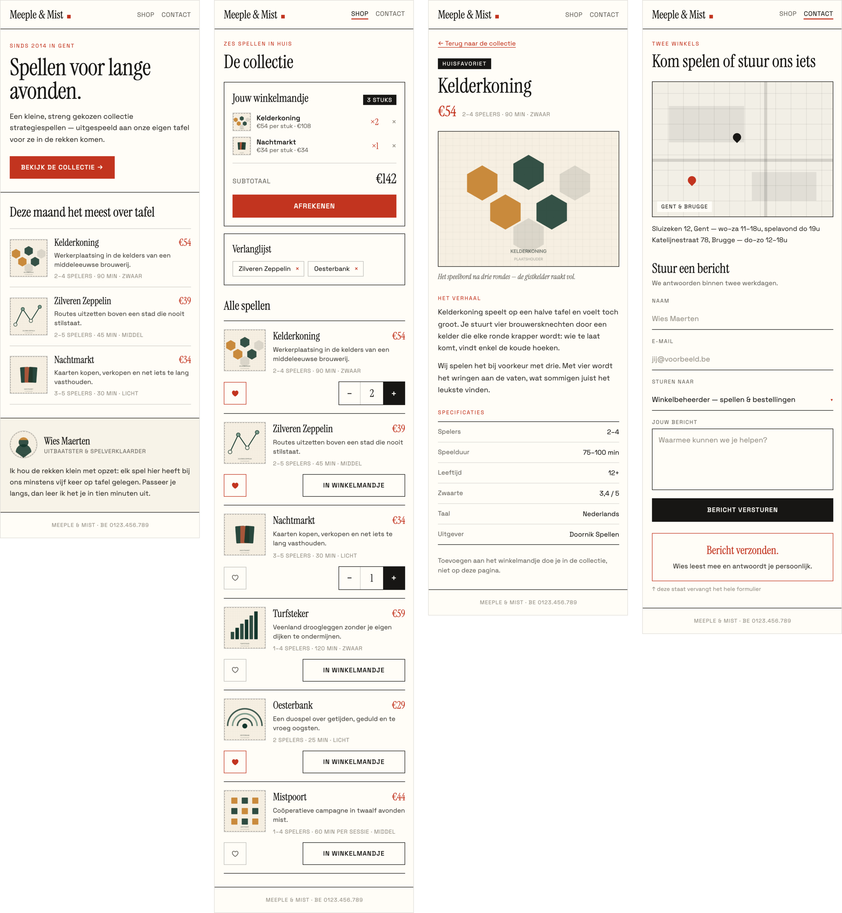
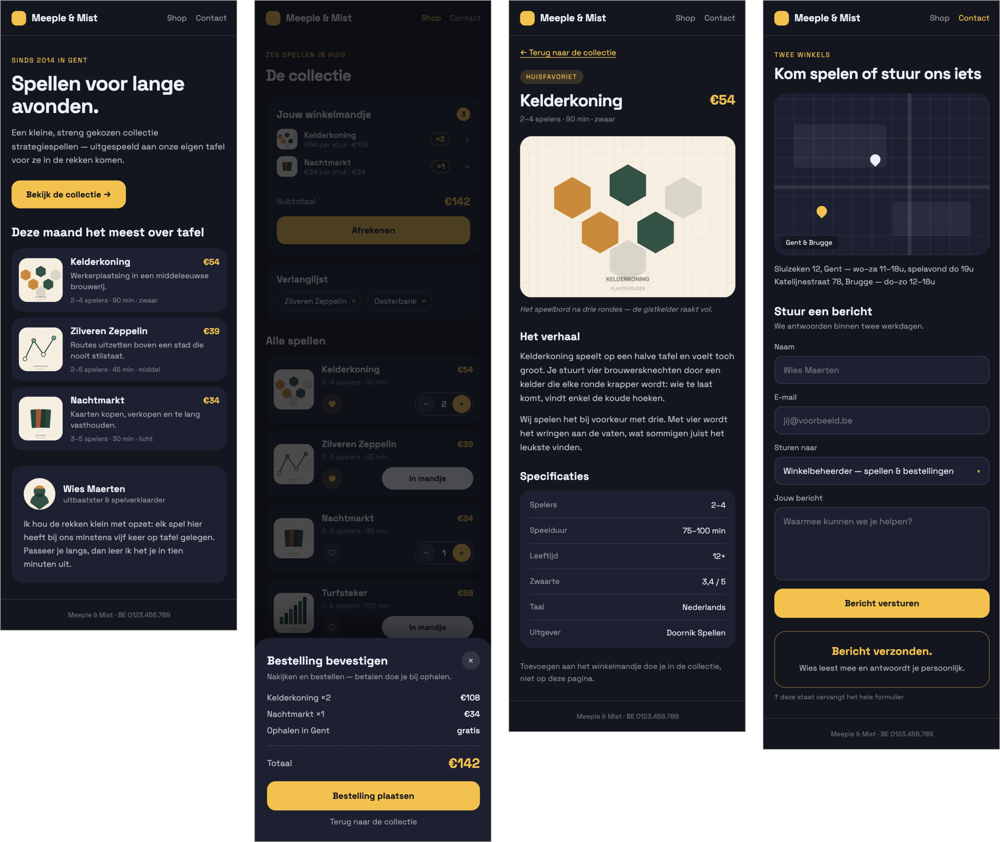

# Projectinformatie

Je bouwt dit semester een volledige, **responsieve webshop** voor een fictieve organisatie die je zelf verzint: een homepage, een shoppagina, zes productpagina's, een contactpagina en een werkend winkelmandje.

Je doet dat niet in één keer. Het project is opgesplitst in **7 deelopdrachten** die op elkaar voortbouwen, verspreid over het semester. Je begint met een concept en wat teksten, en je eindigt met een webshop die echt werkt. Op het einde presenteer je je resultaat.

Zo kan het eruitzien. Hieronder zie je twee voorbeelden van dezelfde webshop op mobiel. Ze volgen allebei de [wireframes](#wireframes), maar elk met een eigen huisstijl. Zo zie je hoeveel ruimte je hebt met je eigen kleuren, lettertype en content.



<figure><figcaption>Een lichte huisstijl met een papierwitte achtergrond, zwarte lijnen en rode accenten</figcaption></figure>



<figure><figcaption>Een donkere huisstijl met nachtblauw en gele accenten. Op de shoppagina staat de pop-up om de bestelling te bevestigen open.</figcaption></figure>



### Werkend mobiel voorbeeld

In de video hieronder zie je **Squishboel**, een volledig werkende mobiele webshop. Dit is één mogelijke interpretatie van de wireframes. Jouw webshop mag er anders uitzien, zolang je de gevraagde inhoud, opbouw en functionaliteiten respecteert.

<figure>
  <video controls playsinline width="372">
    <source src="voorbeelden/squishboel-mobile.mp4" type="video/mp4">
    Je browser kan deze video niet afspelen. <a href="voorbeelden/squishboel-mobile.mp4">Bekijk of download de video.</a>
  </video>
  <figcaption>Squishboel: een mogelijke mobiele uitwerking van de wireframes</figcaption>
</figure>


**In het kort**

* Je werkt in een **private** repository onder de GitHub-organisatie van dit vak.
* Je volgt de **wireframes** voor mobiel en desktop. Kleuren, lettertype en content kies je zelf.
* Er zijn **drie harde deadlines**: deel 3 (12/03), deel 5 (06/05) en de finale inzending (24/05).
* Je dient in via **Digitap**, met de link naar je repository.
* Je **commit regelmatig**: minstens één commit per deelopdracht.


***

## Wireframes

Wanneer je een website bouwt, vertrek je meestal vanaf een design. Vaak begint dat met **wireframes**: eenvoudige schetsen die tonen welke elementen er op een pagina staan en hoe ze geordend zijn, zonder kleuren, lettertypes of echte content. Als developer zet jij die wireframes om naar een werkende website. Dat is precies wat je hier doet.

Voor elke pagina van je webshop is er een **mobiele** en een **desktop**-wireframe. Zo lees je ze:

* **Grijze balken** zijn tijdelijke tekst. Die vervang je door je eigen content uit [deelopdracht 1](deelopdracht-1-concept-content.md).
* **Kaders met een kruis** zijn afbeeldingen.
* **Blauwe elementen** zijn accenten, zoals labels, prijzen, de link terug naar de shop en de actieve link in de navigatie. Die krijgen de accentkleur uit je styleguide.
* **Stippellijnen** tonen een alternatieve toestand, bv. de bevestiging die verschijnt nadat je een formulier hebt verstuurd.
* **Kleine grijze notities** (bv. _↑ H2 van de pagina_) zijn uitleg bij de wireframe en horen niet op je pagina.
* Teksten zoals _In winkelmandje_ of _Afrekenen_ zijn voorbeelden: je mag ze aanpassen aan je eigen webshop. Alle teksten op je webshop schrijf je [in het Nederlands](#copywriting-tips).

### Mobiel



<figure><figcaption>Homepage: hero, bestsellers en bio</figcaption></figure>



<figure><figcaption>Shop: winkelmandje, wishlist en alle producten</figcaption></figure>



<figure><figcaption>Productdetail: foto, beschrijving, specificaties en knoppen</figcaption></figure>



<figure><figcaption>Contact: kaart, contactformulier en bevestiging</figcaption></figure>



### Desktop



<figure><figcaption>Homepage: intro en bio links, bestsellers rechts</figcaption></figure>



<figure><figcaption>Shop: producten in een raster, winkelmandje en wishlist rechts</figcaption></figure>



<figure><figcaption>Productdetail: foto links, tekst en specificaties rechts</figcaption></figure>



<figure><figcaption>Contact: kaart links, contactformulier rechts</figcaption></figure>



Je vindt elke wireframe ook terug bij de deelopdracht waarin je die pagina bouwt: de mobiele versies in [deelopdracht 2](deelopdracht-2-opbouw-html-css.md), de desktopversies in [deelopdracht 3](deelopdracht-3-development-responsive.md), en de contactpagina in [deelopdracht 4](deelopdracht-4-contact-page-formulier.md).


Hou je zo strikt mogelijk aan de opbouw van de wireframes: welke elementen er op een pagina staan en in welke volgorde. Hoe goed jij de wireframes hebt omgezet naar HTML en CSS bepaalt een groot deel van je eindscore, zie [Evaluatie](evaluatie.md).


### Mobile-first

We werken volgens het **mobile-first** principe: je optimaliseert je website eerst voor **smartphones**. Pas in deelopdracht 3 voeg je optimalisaties toe voor **tablets, laptops en desktops**.

***

## Zo start je

Voor je aan deelopdracht 1 begint, zet je één keer je GitHub-repository op. Je pusht daar je commits naartoe tot de finale deadline. Daarna wordt de repository afgesloten en kan je niets meer wijzigen.

###  Je repository aanmaken

1. Maak een GitHub-account aan met je AP e-mailadres, of log in op je bestaande account. Heb je al een GitHub-account met een persoonlijk e-mailadres? Dan kan je jouw AP e-mailadres als secundair adres toevoegen in de instellingen.
2. Ga naar de [uitnodigingslink](https://github-inviter.vercel.app?key=i-love-html-12345) van onze GitHub-organisatie.
3. Vul je `ap.student.be` e-mailadres in en klik op **Request invite**.
4. Je ontvangt een e-mail van GitHub met een uitnodiging om lid te worden van de organisatie. Klik op **Join**.
5. Klik op GitHub op je profielfoto rechtsboven en kies **Your organizations**. De organisatie van dit vak heet **`webtechnologie-<academiejaar>`**, met het lopende academiejaar in de vorm `jjjj-jjjj`. Klik erop.
6. Klik op de tab **Repositories** en vervolgens op **New repository**.
7. Kies een naam volgens deze naamgevingsconventie: `projectopdracht-webtechnologie-<je naam>`. Vervang `<je naam>` door je eigen naam.
8. Kies voor een **Private** repository. De rest van de instellingen laat je op de standaardwaarden staan. Klik op **Create repository**.


Weet je niet meer hoe je een repository lokaal cloont of hoe je commit vanuit Codium? Dat staat stap voor stap in de [Startgids labo's](../labos/labo0.md).


***

## Planning & deadlines

| Deel | Onderdeel                                                                        | Deadline                            | Indienen via Digitap | Feedback mogelijk |
| ---- | -------------------------------------------------------------------------------- | ----------------------------------- | -------------------- | ----------------- |
| 1    | [Concept & content](deelopdracht-1-concept-content.md)                           | LW1 · 08/02/2026 (aanbevolen)       | ❌                    | ❌                 |
| 2    | [Development mobiele website met HTML en CSS](deelopdracht-2-opbouw-html-css.md) | LW2 · 22/02/2026 (aanbevolen)       | ❌                    | ❌                 |
| 3    | [Development responsive webshop](deelopdracht-3-development-responsive.md)       | LW5 · **12/03/2026**                | ✅                    | ✅                 |
| 4    | [Contact page formulier](deelopdracht-4-contact-page-formulier.md)               | LW6 · 22/03/2026 (aanbevolen)       | ❌                    | ❌                 |
| 5    | [Winkelmandje & wishlist](deelopdracht-5-winkelmandje-wishlist.md)               | LW10 · **06/05/2026**               | ✅                    | ✅                 |
| 6    | [Contact page kaart & bevestiging](deelopdracht-6-contact-page-kaart.md)         | LW11 · 10/05/2026 (aanbevolen)      | ❌                    | ❌                 |
| 7    | [**Dynamische content (finale inzending)**](deelopdracht-7-dynamische-content.md) | LW11 · **24/05/2026**               | ✅                    | ❌                 |
| 8    | Presentatie                                                                      | LW13 · tijdens de laatste 2 lessen  | ❌                    | ❌                 |

De **vetgedrukte deadlines zijn hard**: die inzendingen moeten via Digitap binnen zijn. De overige data zijn aanbevolen en helpen je om op schema te blijven. Elke deelopdracht bouwt voort op de vorige, dus zorg ervoor dat je elke deelopdracht grondig doorneemt en uitvoert. Achterstand loop je niet gemakkelijk meer in.

***

## Indienen, feedback & presentatie

### Indienen

Je dient in door de link naar je GitHub-repository in te zenden via [Digitap](https://learning.ap.be). Enkel **private** repositories onder de GitHub-organisatie van dit vak worden aanvaard.


Zorg dat je tijdig indient. Te late inzendingen worden niet aanvaard.


### Feedback

Je kan tussentijds feedback krijgen van de lector na **deel 3** (volledige responsive webshop) en na **deel 5** (winkelmandje & wishlist).

Voorwaarde: je hebt je werk tijdig ingediend via Digitap **én** je bent aanwezig in de eerstvolgende les.

Die feedback is inhoudelijk en levert geen punten op. Het is je kans om te weten waar je staat vóór de finale inzending, dus maak er gebruik van.

### Presentatie en verdediging

Na je finale inzending kom je tijdens de laatste lesweek je webshop presenteren. Daarna krijg je **technische vragen over je eigen werk**. Zorg dus dat je van elk stuk code kan uitleggen wat het doet en waarom je het zo hebt aangepakt.

Deelopdracht 7 is je finale inzending. Mis die inzending via Digitap zeker niet.

***

## Regels & richtlijnen

Deze regels gelden voor je hele project. Lees ze nu één keer door en kom terug wanneer je ze nodig hebt.

### Git-historiek

We verwachten een **propere git-historiek** met **minstens één commit per deelopdracht**. Dat toont aan dat je gespreid en zelfstandig aan je project hebt gewerkt, en het telt mee in de [evaluatie](evaluatie.md).

Wat verwachten we precies?

* Werk **incrementeel**: commit telkens wanneer je een afgerond stuk werk hebt, in plaats van alles in één grote commit op het einde.
* Voorzie **minstens één commit per deelopdracht**. Meerdere kleinere commits per deelopdracht mag en wordt aangemoedigd.
* Gebruik **duidelijke commit messages** die beschrijven wat je hebt aangepast, bv. `Contactformulier validatie toegevoegd` in plaats van `update` of `fix`.
* Push je werk **regelmatig** naar GitHub, niet enkel vlak voor de deadline.
* Commit **geen** overbodige bestanden (bv. `.DS_Store`, `node_modules`, editor-config). Gebruik een `.gitignore`.

### Coding guidelines

Alle code die je schrijft moet voldoen aan de [Coding Guidelines](../coding-guidelines.md). Volg die richtlijnen zorgvuldig: ze zorgen voor een consistente en professionele webshop, en het niet volgen ervan kost je punten.

### Copywriting tips

Je schrijft **alle teksten zelf** en **in het Nederlands**. Content is een belangrijk onderdeel van je webshop, dus neem er voldoende tijd voor.

Alle regels voor je teksten

* Alle teksten voor je webshop moeten **in het Nederlands** worden geschreven.
* Vermijd schrijffouten. Gebruik spellingscorrectie.
* **Kopieer geen teksten** van het internet waar copyright op rust. Zorg dat je originele teksten gebruikt.
* **AI-tools**: maak gerust gebruik van AI, zoals **ChatGPT**, om teksten te genereren of inspiratie op te doen.
* Houd teksten beknopt en helder.
* Laat je tekst op het einde eens nalezen door iemand anders.

### Afbeelding tips

Je gebruikt **enkel rechtenvrije afbeeldingen**, telkens met een **bronvermelding** in de `figcaption`. Productfoto's zijn vierkant: **500x500px**.

Rechtenvrije afbeeldingen vinden

Gebruik **enkel rechtenvrije afbeeldingen** die je zelf hebt gemaakt of die beschikbaar zijn via platforms met een vrije licentie, zoals:

* [Unsplash](https://unsplash.com/)
* [Pexels](https://www.pexels.com/)
* [Pixabay](https://pixabay.com/)

**Tip:** kan je geen perfecte afbeelding vinden voor je product? Kies dan een meer generieke afbeelding die het idee van je product goed weergeeft. Voor een webshop die voetbalschoenen verkoopt, zoek je bijvoorbeeld naar generieke, rechtenvrije foto's van voetbalschoenen.

Afbeeldingen gegenereerd met AI kunnen ook, maar probeer origineel te zijn.

Bronvermelding & bestandsnamen

* **Voeg altijd een bronvermelding toe** bij rechtenvrije afbeeldingen, in de `figcaption` van de afbeelding. Dit is een vriendelijke geste naar de fotograaf en het stelt de lectoren in staat om te controleren waar jij je afbeeldingen vandaan hebt gehaald.
* Zorg dat elke afbeelding een **duidelijke bestandsnaam** heeft, bv. `product-zaadjes-lavendel.jpg`.
* Zorg voor een goede organisatie van je foto's in een mappenstructuur.

Bijsnijden & aspect ratio's

Gebruik gratis tools om je afbeeldingen bij te snijden naar de juiste afmetingen en **aspect ratio's**:

* [⭐️ Photopea](https://www.photopea.com/)
* [Affinity](https://www.affinity.studio/photo-editing-software)
* [Adobe Express](https://www.adobe.com/express/feature/image/resize)
* [Imagy.app](https://imagy.app/)

Voor productfoto's ga je voor vierkante afbeeldingen van **500x500px**.

