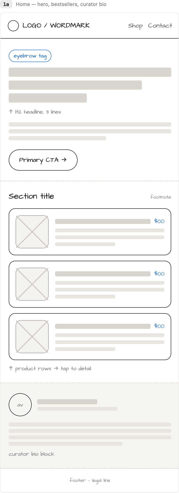
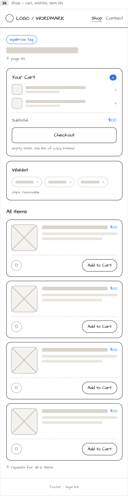
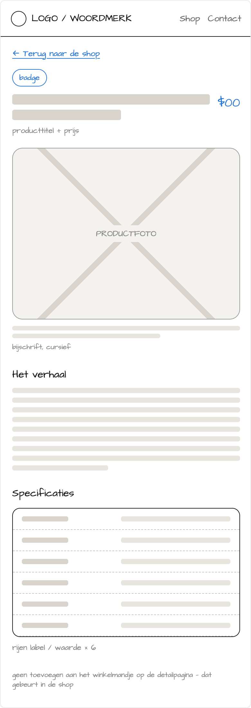
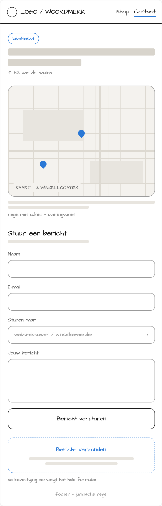
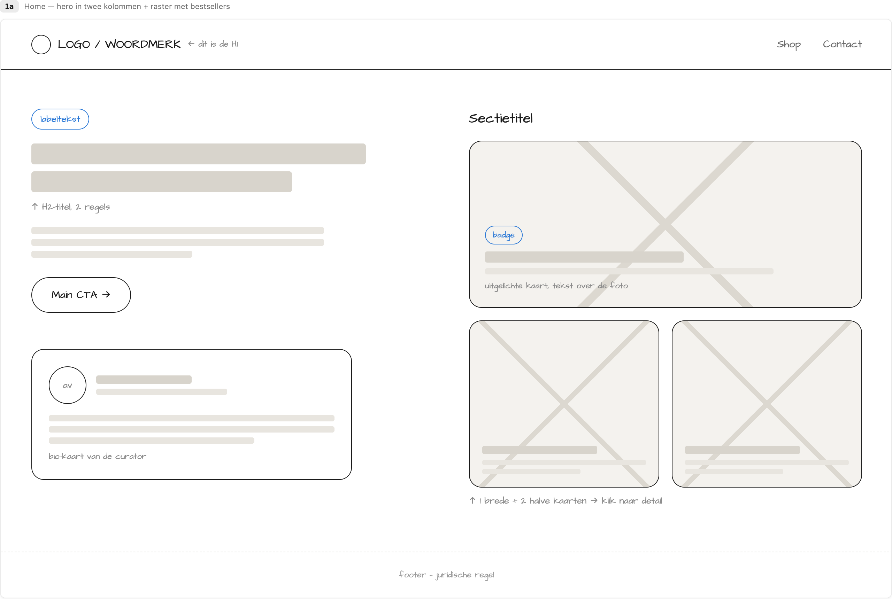
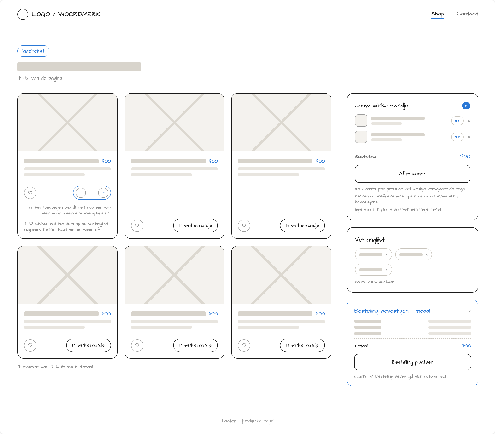
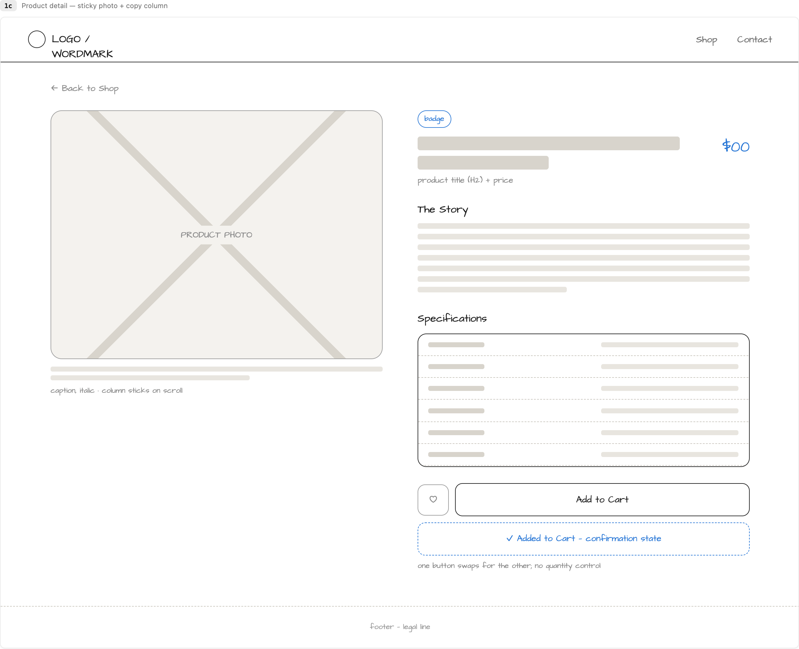
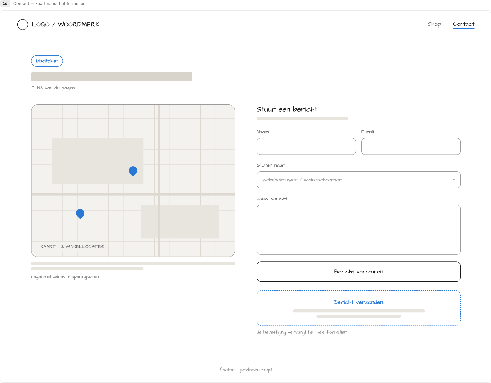

# Projectinformatie

Je bouwt dit semester een **responsieve webshop** voor een fictieve organisatie die je zelf bedenkt. Je werkt in **7 deelopdrachten**, van concept tot werkende webshop. Daarna presenteer je je werk en beantwoord je vragen over je code.

Op deze pagina vind je [wat je bouwt](#wat-bouw-je), [hoe je je repository aanmaakt](#je-repository-aanmaken), de [planning](#planning-and-indienen), de [regels](#regels-and-richtlijnen) en de [wireframes](#wireframes).

## Wat bouw je?

Je webshop heeft **9 pagina's**:

| Pagina | Aantal | Inhoud |
| ------ | ------ | ------ |
| Homepage | 1 | Hero (introductie bovenaan), bestsellers en bio |
| Shoppagina | 1 | Alle producten, winkelmandje en wishlist |
| Productdetailpagina | 6 | Foto, beschrijving, specificaties en knoppen |
| Contactpagina | 1 | Kaart, contactformulier en bevestiging |

Je volgt de opbouw van de [wireframes](#wireframes). Je kiest zelf de kleuren, het lettertype en de inhoud in je styleguide van [deelopdracht 1](deelopdracht-1-concept-content.md).

Je werkt **mobile-first**: in [deelopdracht 2](deelopdracht-2-opbouw-html-css.md) bouw je de website voor smartphones. In [deelopdracht 3](deelopdracht-3-development-responsive.md) pas je de lay-out aan grotere schermen aan.

## Je repository aanmaken

Je gebruikt **één private repository onder de GitHub-organisatie van dit vak** voor het hele project.

1. Maak een GitHub-account aan met je AP-e-mailadres of log in op je bestaande account. Gebruik je een persoonlijk e-mailadres? Voeg je AP-e-mailadres dan toe als secundair adres in je accountinstellingen.
2. Open de [uitnodigingslink](https://github-inviter.vercel.app?key=i-love-html-12345), vul je `ap.student.be`-e-mailadres in en klik op **Request invite**.
3. Open de uitnodigingsmail van GitHub en klik op **Join**.
4. Klik op GitHub op je profielfoto en kies **Your organizations**. Open **`webtechnologie-<academiejaar>`**. Het academiejaar heeft de vorm `jjjj-jjjj`.
5. Ga naar **Repositories** en klik op **New repository**.
6. Geef je repository de naam `projectopdracht-webtechnologie-<je naam>`. Vervang `<je naam>` door je eigen naam.
7. Kies **Private**, laat de overige instellingen staan en klik op **Create repository**.

Hoe je de repository lokaal cloont en vanuit Codium commits maakt, lees je in de [Startgids labo's](../labos/labo0.md).

## Planning & indienen

Werk de deelopdrachten in volgorde af: elke opdracht bouwt voort op de vorige. De planning heeft drie soorten data:

* **Aanbevolen**: je dient niets in. Heb je de deelopdracht op die datum af, dan zit je op schema.
* **Feedbackdeadline**: dien je werk in als je feedback wilt. Dat is optioneel. Zie [Feedback](#feedback).
* **Finale deadline**: je dient je volledige webshop in. Dat is verplicht.

**LW** staat voor lesweek.

| Deel | Onderdeel | Datum | Soort |
| ---- | --------- | ----- | ----- |
| 1 | [Concept en content](deelopdracht-1-concept-content.md) | LW1 · 27/09/2026 | Aanbevolen |
| 2 | [Mobiele website met HTML en CSS](deelopdracht-2-opbouw-html-css.md) | LW3 · 11/10/2026 | Aanbevolen |
| 3 | [Responsive webshop](deelopdracht-3-development-responsive.md) | LW5 · **25/10/2026** | **Feedbackdeadline 1** |
| 4 | [Contactformulier](deelopdracht-4-contact-page-formulier.md) | LW6 · 01/11/2026 | Aanbevolen |
| 5 | [Winkelmandje en wishlist](deelopdracht-5-winkelmandje-wishlist.md) | LW10 · **29/11/2026** | **Feedbackdeadline 2** |
| 6 | [Kaart en bevestiging](deelopdracht-6-contact-page-kaart.md) | LW11 · 06/12/2026 | Aanbevolen |
| 7 | [Dynamische content](deelopdracht-7-dynamische-content.md) | LW13 · **20/12/2026** | **Finale deadline** |
| | [Presentatie en verdediging](#presentatie-and-verdediging) | Week van **04/01/2027** | Verplicht |


**De finale deadline is 20 december 2026.** Te late inzendingen worden niet aanvaard. Na deze deadline wordt je repository afgesloten en kan je niets meer wijzigen.


### Indienen

Dien bij elke feedbackronde waaraan je deelneemt en bij de finale deadline als volgt in:

1. Push je laatste wijzigingen naar GitHub.
2. Dien de **link naar je repository** in via [Digitap](https://learning.ap.be).

Enkel **private repositories onder de GitHub-organisatie van dit vak** worden aanvaard.

### Feedback

Na deelopdracht 3 en deelopdracht 5 kan je feedback krijgen van de lector. Daarvoor moet je aan **beide voorwaarden** voldoen:

* Je hebt je werk uiterlijk op de feedbackdeadline ingediend via Digitap.
* Je bent aanwezig in de eerstvolgende les.

Feedback levert geen punten op. Ze helpt je om je werk te verbeteren vóór de finale inzending.

### Presentatie & verdediging

Na de finale deadline presenteer je je webshop en beantwoord je technische vragen over je eigen code. Je moet kunnen uitleggen **wat je code doet en waarom je die zo hebt geschreven**.

## Regels & richtlijnen

### Git-historiek

Je git-historiek telt mee in de [evaluatie](evaluatie.md). Ze moet tonen dat je regelmatig en zelfstandig aan je project werkt.

* Maak een commit na elk afgerond stuk werk, met **minstens één commit per deelopdracht**.
* Schrijf duidelijk wat je hebt aangepast, bv. `Validatie contactformulier toegevoegd` in plaats van `update`.
* Push regelmatig naar GitHub.
* Gebruik een `.gitignore` om overbodige bestanden uit je repository te houden, zoals `.DS_Store`, `node_modules` en editorconfiguratie.

### Coding guidelines

Volg de [Coding Guidelines](../coding-guidelines.md) voor al je code. Wie ze niet volgt, verliest punten.

### Teksten

* Schrijf alle teksten **in het Nederlands**.
* Schrijf originele teksten. Kopieer geen teksten van het internet waarop copyright rust.
* Je mag AI-tools zoals ChatGPT gebruiken voor inspiratie of om teksten te genereren.
* Hou je teksten kort en duidelijk. Gebruik spellingscorrectie en laat iemand je teksten nalezen.

### Afbeeldingen

* Gebruik **enkel rechtenvrije afbeeldingen**: eigen foto's of foto's met een vrije licentie, bijvoorbeeld van [Unsplash](https://unsplash.com/), [Pexels](https://www.pexels.com/) of [Pixabay](https://pixabay.com/). AI-afbeeldingen mogen ook. Probeer origineel te zijn.
* Voeg bij elke afbeelding een **bronvermelding in de `figcaption`** toe. Zo geef je de maker krediet en kan de lector de bron controleren.
* Maak productfoto's **vierkant: 500 × 500 pixels**.
* Gebruik duidelijke bestandsnamen, bv. `product-zaadjes-lavendel.jpg`, en een logische mappenstructuur.

Vind je geen geschikte productfoto? Kies dan een algemene afbeelding die je product goed weergeeft, zoals een rechtenvrije foto van voetbalschoenen voor een shop met voetbalschoenen.

Tools om afbeeldingen bij te snijden

Met deze tools kan je afbeeldingen bijsnijden tot de juiste afmetingen en beeldverhouding:

* [Photopea](https://www.photopea.com/)
* [Affinity](https://www.affinity.studio/photo-editing-software)
* [Adobe Express](https://www.adobe.com/express/feature/image/resize)
* [Imagy.app](https://imagy.app/)

## Wireframes

Wireframes zijn eenvoudige schetsen van je pagina's. Ze tonen **welke elementen je nodig hebt en waar ze staan**. Kleuren, lettertype en inhoud haal je uit je styleguide van [deelopdracht 1](deelopdracht-1-concept-content.md). Je hoeft geen apart, volledig design te maken voor je begint te bouwen.


**Volg de opbouw en volgorde van de wireframes zo nauwkeurig mogelijk.** Hoe je ze omzet naar HTML en CSS bepaalt een groot deel van je eindscore. Bekijk de [evaluatiecriteria](evaluatie.md).


### Zo lees je de wireframes

| Wat zie je? | Wat doe je ermee? |
| ----------- | ---------------- |
| Grijze balken | Vervang ze door je eigen teksten uit deelopdracht 1. |
| Kaders met een kruis | Plaats hier afbeeldingen. |
| Blauwe elementen | Gebruik hiervoor de accentkleur uit je styleguide. |
| Stippellijnen | Ze tonen een andere toestand, zoals een bevestiging na het versturen van een formulier. |
| Kleine grijze notities, bv. *↑ H2 van de pagina* | Dit is uitleg. Neem die niet over op je website. |
| Teksten zoals *In winkelmandje* of *Afrekenen* | Je mag deze voorbeelden aanpassen aan je webshop. Hou ze in het Nederlands. |

### Mobiel



<figure><figcaption>Homepage: hero, bestsellers en bio</figcaption></figure>



<figure><figcaption>Shop: winkelmandje, wishlist en alle producten</figcaption></figure>



<figure><figcaption>Productdetail: foto, beschrijving, specificaties en knoppen</figcaption></figure>



<figure><figcaption>Contact: kaart, contactformulier en bevestiging</figcaption></figure>



### Desktop



<figure><figcaption>Homepage: intro en bio links, bestsellers rechts</figcaption></figure>



<figure><figcaption>Shop: producten in een raster, winkelmandje en wishlist rechts</figcaption></figure>



<figure><figcaption>Productdetail: foto links, tekst en specificaties rechts</figcaption></figure>



<figure><figcaption>Contact: kaart links, contactformulier rechts</figcaption></figure>



De wireframes staan ook bij de bijbehorende opdrachten: mobiel bij [deelopdracht 2](deelopdracht-2-opbouw-html-css.md), desktop bij [deelopdracht 3](deelopdracht-3-development-responsive.md) en de contactpagina bij [deelopdracht 4](deelopdracht-4-contact-page-formulier.md).

## Voorbeeld

**Squishboel** toont hoe een werkende webshop volgens de wireframes eruit kan zien. Je eigen webshop mag een andere huisstijl hebben, zolang je de gevraagde inhoud, opbouw en functies behoudt.



{% embed url="https://3533814547-files.gitbook.io/~/files/v0/b/gitbook-x-prod.appspot.com/o/spaces%2FmRXarEZCtx30bQroTgyM%2Fuploads%2Fgit-blob-c560203ff6d7ff27626983b3cbbc058f41e82c1b%2Fsquishee-mobile.mp4?alt=media&v=2" %}

*Squishboel: een mogelijke mobiele uitwerking van de wireframes*



Dezelfde inhoud en functionaliteiten, maar de lay-out past zich aan de grotere schermbreedte aan.

{% embed url="https://3533814547-files.gitbook.io/~/files/v0/b/gitbook-x-prod.appspot.com/o/spaces%2FmRXarEZCtx30bQroTgyM%2Fuploads%2Fgit-blob-7e26eec8c1ab082651524091c1918d4d6f09ff45%2Fsquishboel-desktop.mp4?alt=media" %}

*Squishboel: een mogelijke desktopuitwerking van de wireframes*


